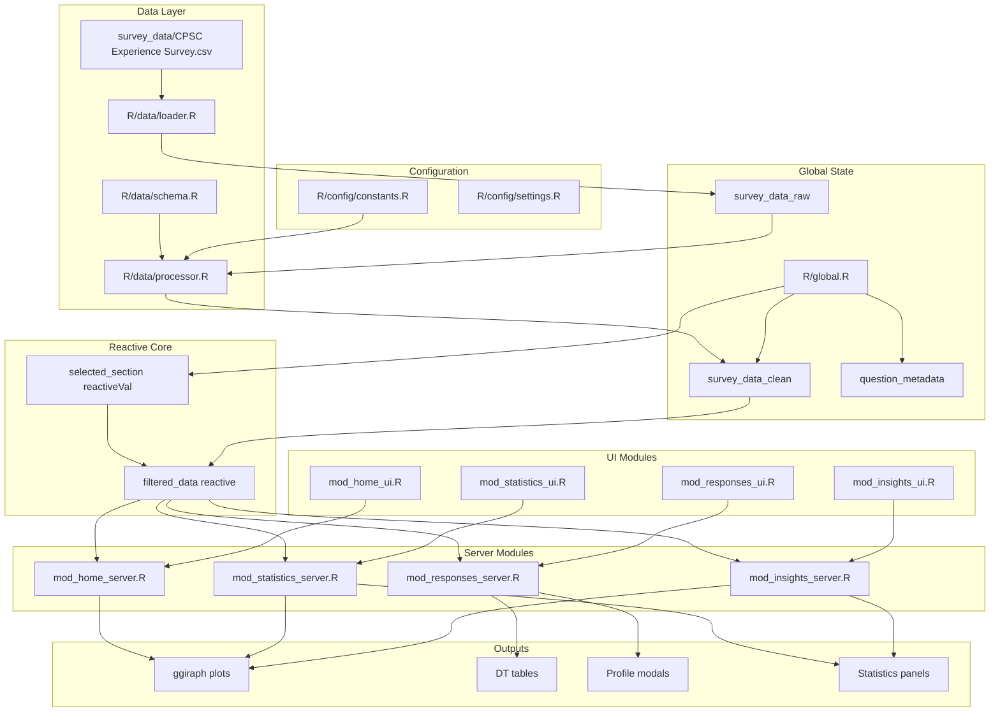
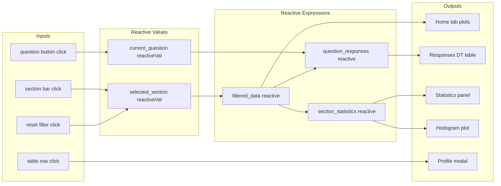

# CPSC Experience Survey Explorer - Architecture Document

## 1. Project Overview

This document describes the technical architecture for a production-ready Shiny application that analyzes student survey responses. The application follows modular design principles with clear separation of concerns.

---

## 2. Project File Structure

```
op-survey-analysis/
├── app.R                          # Application entry point (bootstrap)
├── application.yml                # Configuration file
├── Dockerfile                     # Container definition
├── docker-compose.yml            # Orchestration
├── nginx.conf                    # Reverse proxy config
│
├── R/
│   ├── app_main.R                # Main app assembly (~50 lines)
│   ├── global.R                  # Global imports and config (~100 lines)
│   │
│   ├── config/
│   │   ├── constants.R           # Survey column mappings, colors (~150 lines)
│   │   └── settings.R            # App settings, defaults (~100 lines)
│   │
│   ├── data/
│   │   ├── loader.R              # Data loading functions (~100 lines)
│   │   ├── processor.R           # Data cleaning/transformations (~250 lines)
│   │   └── schema.R              # Column definitions, types (~150 lines)
│   │
│   ├── modules/
│   │   ├── home/
│   │   │   ├── mod_home_ui.R           # Home tab UI (~150 lines)
│   │   │   ├── mod_home_server.R       # Home tab server logic (~300 lines)
│   │   │   └── mod_home_plots.R        # Home tab plot functions (~300 lines)
│   │   │
│   │   ├── responses/
│   │   │   ├── mod_responses_ui.R      # Question responses UI (~150 lines)
│   │   │   ├── mod_responses_server.R  # Question responses server (~300 lines)
│   │   │   └── mod_profile_modal.R     # Participant profile modal (~200 lines)
│   │   │
│   │   ├── statistics/
│   │   │   ├── mod_statistics_ui.R     # Statistics tab UI (~150 lines)
│   │   │   ├── mod_statistics_server.R # Statistics tab server (~300 lines)
│   │   │   └── mod_statistics_plots.R  # Histogram functions (~200 lines)
│   │   │
│   │   ├── insights/
│   │   │   ├── mod_insights_ui.R       # Insights tab UI (~200 lines)
│   │   │   ├── mod_insights_server.R   # Insights tab server (~350 lines)
│   │   │   ├── mod_correlation.R       # Correlation analysis (~200 lines)
│   │   │   ├── mod_regression.R        # Regression analysis (~200 lines)
│   │   │   ├── mod_segmentation.R      # Student clustering (~250 lines)
│   │   │   └── mod_effect_size.R       # Effect size calculations (~150 lines)
│   │   │
│   │   └── shared/
│   │       ├── mod_filter.R            # Section filter module (~150 lines)
│   │       ├── mod_plot_utils.R        # Shared plot utilities (~200 lines)
│   │       └── mod_table_utils.R       # Shared DT utilities (~150 lines)
│   │
│   ├── utils/
│   │   ├── likert.R              # Likert scale processing (~150 lines)
│   │   ├── statistics.R          # Statistical functions (~200 lines)
│   │   ├── text_processing.R     # Free-text cleaning (~100 lines)
│   │   └── error_handling.R      # Error handlers, logging (~150 lines)
│   │
│   └── www/
│       ├── css/
│       │   ├── main.css          # Global styles (~200 lines)
│       │   ├── components.css    # Component styles (~150 lines)
│       │   └── accessibility.css # A11y enhancements (~100 lines)
│       └── js/
│           └── interactions.js   # Custom JS interactions (~100 lines)
│
├── tests/
│   ├── testthat/
│   │   ├── test_data_processor.R
│   │   ├── test_likert.R
│   │   └── test_statistics.R
│   └── testthat.R
│
├── docs/
│   ├── ARCHITECTURE.md           # This document
│   ├── data_details.md           # Data structure documentation
│   └── UX_DOCUMENTATION.md       # UX requirements
│
└── survey_data/
    └── CPSC Experience Survey.csv
```

---

## 3. Module Breakdown and Responsibilities

### 3.1 Core Application Files

#### [`app.R`](app.R)
- **Purpose**: Application entry point
- **Responsibilities**: Source all modules, run Shiny app
- **Size**: ~10 lines (delegates to `app_main.R`)

#### [`R/app_main.R`](R/app_main.R)
- **Purpose**: Main application assembly
- **Responsibilities**: 
  - Define UI structure with navbar layout
  - Call module UI functions
  - Define server function with module servers
- **Key Functions**:
  - `ui <- navbarPage(...)` - Main UI container
  - `server <- function(input, output, session) {...}` - Server entry

#### [`R/global.R`](R/global.R)
- **Purpose**: Global initialization
- **Responsibilities**:
  - Load all required packages with `library()`
  - Source all module files
  - Load and process survey data
  - Create reactive values for shared state
- **Key Objects**:
  - `survey_data_raw` - Raw data from CSV
  - `survey_data_clean` - Processed data
  - `question_metadata` - Question definitions

---

### 3.2 Configuration Modules

#### [`R/config/constants.R`](R/config/constants.R)
- **Purpose**: Define immutable constants
- **Responsibilities**:
  - Column name mappings
  - Likert scale definitions
  - Color palettes for visualizations
  - Section identifiers
- **Key Constants**:
```r
# Column mappings
COL_TIMESTAMP <- "Timestamp"
COL_SECTION <- "What section are you in?"
COL_EXPERIENCE <- "Prior to taking this course, what was your programming experience?"

# Likert scale values
LIKERT_SCALE <- c(
  "1 - Strongly Disagree", "2", "3", "4", "5 - Strongly Agree"
)

# Color palette
COLOR_PALETTE <- c(
  primary = "#2E86AB",
  secondary = "#A23B72",
  success = "#28A745",
  warning = "#FFC107",
  danger = "#DC3545"
)

# Section identifiers
SECTIONS <- c("231 - 1pm", "231 - 11am", "231 - 3pm", 
              "217 - 1pm", "217 - 11am", "217 - 3pm")
```

#### [`R/config/settings.R`](R/config/settings.R)
- **Purpose**: Configurable app settings
- **Responsibilities**:
  - Default table page size
  - Plot dimensions
  - Animation durations
- **Key Settings**:
```r
TABLE_PAGE_SIZE <- 30
PLOT_WIDTH <- 800
PLOT_HEIGHT <- 400
ANIMATION_DURATION <- 300
```

---

### 3.3 Data Modules

#### [`R/data/loader.R`](R/data/loader.R)
- **Purpose**: Load survey data from file
- **Responsibilities**:
  - Read CSV with proper encoding
  - Handle file not found errors
  - Validate data structure
- **Key Functions**:
```r
load_survey_data <- function(file_path) {
  # Returns: tibble with raw survey data
  # Errors: File not found, invalid format
}

validate_data_structure <- function(data, expected_cols) {
  # Returns: TRUE/FALSE with validation messages
}
```

#### [`R/data/processor.R`](R/data/processor.R)
- **Purpose**: Clean and transform data
- **Responsibilities**:
  - Parse Likert scale values (extract numeric)
  - Parse multi-select Discord field
  - Generate participant IDs
  - Clean free-text responses
  - Split section identifiers
- **Key Functions**:
```r
process_survey_data <- function(raw_data) {
  # Returns: processed tibble with cleaned columns
}

extract_likert_numeric <- function(likert_string) {
  # Extracts numeric value from "1 - Strongly Disagree" format
  # Returns: integer 1-5
}

parse_discord_multiselect <- function(discord_string) {
  # Parses semicolon-separated values
  # Returns: named logical vector
}

generate_participant_id <- function(timestamp, section) {
  # Creates unique ID from timestamp + section + sequence
  # Returns: character ID like "P001"
}

clean_free_text <- function(text) {
  # Removes extra whitespace, normalizes line breaks
  # Returns: cleaned character string
}
```

#### [`R/data/schema.R`](R/data/schema.R)
- **Purpose**: Define data schema and metadata
- **Responsibilities**:
  - Column type definitions
  - Question groupings
  - Question display names
- **Key Objects**:
```r
QUESTION_GROUPS <- list(
  course_satisfaction = c(
    "content_relevant", "excited_content", "satisfied_feedback",
    "apply_learning", "easy_ask_help", "meeting_goals"
  ),
  learning_methods = c(
    "pre_written_code", "studying_midterms", "tophat_quizzes",
    "presentation_slides", "handouts_notes", "coding_own",
    "live_coding", "labs", "ask_questions", "assignments"
  ),
  community_belonging = c(
    "comfortable_speaking", "part_of_class", "friends_important",
    "university_community", "easy_meet_people"
  )
)

FREE_TEXT_QUESTIONS <- list(
  q_expectations = "How is the course meeting your expectations...",
  q_preference_reason = "Why is this your preferred way of learning?",
  # ... etc
)
```

---

### 3.4 Feature Modules

#### Home Tab Module

##### [`R/modules/home/mod_home_ui.R`](R/modules/home/mod_home_ui.R)
- **Purpose**: Home tab UI definition
- **Responsibilities**:
  - Response overview section
  - Section filter display
  - Six visualization panels
- **Key Functions**:
```r
mod_home_ui <- function(id) {
  ns <- NS(id)
  tagList(
    fluidRow(
      # Response overview with section filter
      column(12, mod_filter_ui(ns("filter"))),
    ),
    fluidRow(
      # Six visualization panels in 2x3 grid
      column(6, plot_panel(ns("learning_pref"))),
      column(6, plot_panel(ns("prior_exp"))),
      # ... etc
    )
  )
}
```

##### [`R/modules/home/mod_home_server.R`](R/modules/home/mod_home_server.R)
- **Purpose**: Home tab server logic
- **Responsibilities**:
  - Coordinate section filtering
  - Update plot titles based on filter
  - Handle section click events
- **Key Functions**:
```r
mod_home_server <- function(id, data, selected_section) {
  moduleServer(id, function(input, output, session) {
    # Reactive filtered data
    filtered_data <- reactive({
      if (is.null(selected_section())) data()
      else dplyr::filter(data(), section == selected_section())
    })
    
    # Render all plots
    output$learning_pref <- renderGirafe({...})
    output$prior_exp <- renderGirafe({...})
    # ... etc
    
    # Return reactive selected section
    return(reactive(input$section_click))
  })
}
```

##### [`R/modules/home/mod_home_plots.R`](R/modules/home/mod_home_plots.R)
- **Purpose**: Plot generation functions
- **Responsibilities**:
  - Create ggiraph interactive plots
  - Apply consistent styling
  - Handle dynamic titles
- **Key Functions**:
```r
plot_learning_preference <- function(data, title_suffix) {
  # Returns: girafe object with interactive bar chart
}

plot_prior_experience <- function(data, title_suffix) {
  # Returns: girafe object with horizontal bar chart
}

plot_course_satisfaction <- function(data, title_suffix) {
  # Returns: girafe object with mean scores
}

plot_discord_engagement <- function(data, title_suffix) {
  # Returns: girafe object with percentage bars
}

plot_learning_methods <- function(data, title_suffix) {
  # Returns: girafe object with top 7 methods
}

plot_community_connection <- function(data, title_suffix) {
  # Returns: girafe object with mean scores
}
```

#### Question Responses Module

##### [`R/modules/responses/mod_responses_ui.R`](R/modules/responses/mod_responses_ui.R)
- **Purpose**: Question responses tab UI
- **Responsibilities**:
  - Question selector buttons
  - DT table display
  - Profile modal trigger
- **Key Functions**:
```r
mod_responses_ui <- function(id) {
  ns <- NS(id)
  tagList(
    fluidRow(
      column(12, question_button_row(ns("questions")))
    ),
    fluidRow(
      column(12, DTOutput(ns("responses_table")))
    )
  )
}

question_button_row <- function(ns_id) {
  # Creates horizontal row of question buttons
  # Returns: div with actionButton elements
}
```

##### [`R/modules/responses/mod_responses_server.R`](R/modules/responses/mod_responses_server.R)
- **Purpose**: Question responses server logic
- **Responsibilities**:
  - Handle question selection
  - Filter responses by question
  - Manage table rendering
  - Trigger profile modal
- **Key Functions**:
```r
mod_responses_server <- function(id, data, selected_section) {
  moduleServer(id, function(input, output, session) {
    # Current selected question
    current_question <- reactiveVal(NULL)
    
    # Filtered responses for selected question
    question_responses <- reactive({
      req(current_question())
      data() %>% 
        filter(section == selected_section() | is.null(selected_section())) %>%
        select(participant_id, all_of(current_question()))
    })
    
    # Render DT table
    output$responses_table <- DT::renderDT({...})
    
    # Handle row click -> show modal
    observeEvent(input$table_row_clicked, {
      show_profile_modal(input$table_row_clicked)
    })
  })
}
```

##### [`R/modules/responses/mod_profile_modal.R`](R/modules/responses/mod_profile_modal.R)
- **Purpose**: Participant profile modal
- **Responsibilities**:
  - Display participant information
  - Show all responses for participant
  - Format free-text responses
- **Key Functions**:
```r
show_profile_modal <- function(participant_id, data, current_question) {
  # Shows modal dialog with participant profile
  # Returns: NULL (side effect: modal display)
}

format_profile_section <- function(participant_data) {
  # Creates HTML formatted profile section
  # Returns: tagList with formatted content
}
```

#### Statistics Module

##### [`R/modules/statistics/mod_statistics_ui.R`](R/modules/statistics/mod_statistics_ui.R)
- **Purpose**: Statistics tab UI
- **Responsibilities**:
  - Category selector
  - Question buttons
  - Statistics summary panel
  - Histogram display
- **Key Functions**:
```r
mod_statistics_ui <- function(id) {
  ns <- NS(id)
  tagList(
    fluidRow(
      column(3, category_selector(ns("category"))),
      column(9, question_button_row(ns("questions")))
    ),
    fluidRow(
      column(4, statistics_summary_panel(ns("stats"))),
      column(8, plotOutput(ns("histogram")))
    )
  )
}
```

##### [`R/modules/statistics/mod_statistics_server.R`](R/modules/statistics/mod_statistics_server.R)
- **Purpose**: Statistics tab server logic
- **Responsibilities**:
  - Calculate descriptive statistics
  - Generate histograms
  - Handle category/question selection
- **Key Functions**:
```r
mod_statistics_server <- function(id, data, selected_section) {
  moduleServer(id, function(input, output, session) {
    # Calculate statistics for selected question
    question_stats <- reactive({
      req(input$selected_question)
      calculate_likert_stats(filtered_data(), input$selected_question)
    })
    
    # Render statistics summary
    output$stats_summary <- renderUI({...}
    
    # Render histogram
    output$histogram <- renderPlot({...})
  })
}
```

##### [`R/modules/statistics/mod_statistics_plots.R`](R/modules/statistics/mod_statistics_plots.R)
- **Purpose**: Statistics visualization functions
- **Responsibilities**:
  - Create Likert histograms
  - Apply consistent styling
  - Handle section comparison view
- **Key Functions**:
```r
plot_likert_histogram <- function(data, question_col, show_by_section = FALSE) {
  # Returns: ggplot/ggiraph histogram
}

calculate_likert_stats <- function(data, question_col) {
  # Returns: named list with N, mean, median, mode, sd, se, min, max, Q1, Q3, missing
}
```

#### Insights Module

##### [`R/modules/insights/mod_insights_ui.R`](R/modules/insights/mod_insights_ui.R)
- **Purpose**: Insights tab UI
- **Responsibilities**:
  - Analysis type selector
  - Results display areas
  - Interactive visualizations
- **Key Functions**:
```r
mod_insights_ui <- function(id) {
  ns <- NS(id)
  tagList(
    navlistPanel(
      "Analysis Types",
      tabPanel("Correlation Matrix", correlation_ui(ns("correlation"))),
      tabPanel("Regression Analysis", regression_ui(ns("regression"))),
      tabPanel("Student Segmentation", segmentation_ui(ns("segmentation"))),
      tabPanel("Section Comparison", comparison_ui(ns("comparison"))),
      tabPanel("Effect Size", effect_size_ui(ns("effect"))),
      tabPanel("Reliability", reliability_ui(ns("reliability"))),
      tabPanel("Satisfaction Predictors", predictors_ui(ns("predictors")))
    )
  )
}
```

##### [`R/modules/insights/mod_insights_server.R`](R/modules/insights/mod_insights_server.R)
- **Purpose**: Insights tab server logic
- **Responsibilities**:
  - Coordinate analysis modules
  - Handle analysis selection
  - Manage loading states
- **Key Functions**:
```r
mod_insights_server <- function(id, data, selected_section) {
  moduleServer(id, function(input, output, session) {
    # Call sub-modules
    correlation_results <- mod_correlation_server("correlation", filtered_data)
    regression_results <- mod_regression_server("regression", filtered_data)
    # ... etc
  })
}
```

##### [`R/modules/insights/mod_correlation.R`](R/modules/insights/mod_correlation.R)
- **Purpose**: Correlation analysis
- **Responsibilities**:
  - Calculate correlation matrix
  - Create interactive heatmap
  - Identify strongest correlations
- **Key Functions**:
```r
mod_correlation_ui <- function(id) {...}
mod_correlation_server <- function(id, data) {
  # Returns: reactive correlation matrix
}

calculate_correlation_matrix <- function(data, likert_columns) {
  # Returns: matrix with correlation values
}

plot_correlation_heatmap <- function(cor_matrix) {
  # Returns: girafe interactive heatmap
}
```

##### [`R/modules/insights/mod_regression.R`](R/modules/insights/mod_regression.R)
- **Purpose**: Regression analysis
- **Responsibilities**:
  - Build predictive models
  - Display variable importance
  - Show model diagnostics
- **Key Functions**:
```r
mod_regression_ui <- function(id) {...}
mod_regression_server <- function(id, data) {
  # Returns: reactive list with model results
}

build_satisfaction_model <- function(data, predictors, outcome) {
  # Returns: lm model object
}

plot_variable_importance <- function(model) {
  # Returns: ggplot bar chart of coefficients
}
```

##### [`R/modules/insights/mod_segmentation.R`](R/modules/insights/mod_segmentation.R)
- **Purpose**: Student clustering/segmentation
- **Responsibilities**:
  - Perform cluster analysis
  - Visualize segment profiles
  - Display segment sizes
- **Key Functions**:
```r
mod_segmentation_ui <- function(id) {...}
mod_segmentation_server <- function(id, data) {
  # Returns: reactive list with cluster assignments
}

perform_clustering <- function(data, n_clusters = 3) {
  # Returns: kmeans or hierarchical cluster result
}

plot_segment_profiles <- function(data, cluster_assignments) {
  # Returns: ggplot showing segment characteristics
}
```

##### [`R/modules/insights/mod_effect_size.R`](R/modules/insights/mod_effect_size.R)
- **Purpose**: Effect size calculations
- **Responsibilities**:
  - Calculate Cohen's d
  - Compare sections
  - Identify meaningful differences
- **Key Functions**:
```r
mod_effect_size_ui <- function(id) {...}
mod_effect_size_server <- function(id, data) {...}

calculate_cohens_d <- function(group1, group2) {
  # Returns: numeric effect size with interpretation
}
```

#### Shared Modules

##### [`R/modules/shared/mod_filter.R`](R/modules/shared/mod_filter.R)
- **Purpose**: Section filter module
- **Responsibilities**:
  - Display current filter state
  - Reset filter button
  - Communicate filter changes
- **Key Functions**:
```r
mod_filter_ui <- function(id) {
  ns <- NS(id)
  tagList(
    uiOutput(ns("filter_status")),
    actionButton(ns("reset"), "Reset Filter")
  )
}

mod_filter_server <- function(id, selected_section) {
  moduleServer(id, function(input, output, session) {
    # Display current section or "All Sections"
    output$filter_status <- renderUI({...}
    
    # Handle reset
    observeEvent(input$reset, {
      selected_section(NULL)
    })
  })
}
```

##### [`R/modules/shared/mod_plot_utils.R`](R/modules/shared/mod_plot_utils.R)
- **Purpose**: Shared plot utilities
- **Responsibilities**:
  - Consistent plot themes
  - Interactive tooltip formatting
  - Color scale helpers
- **Key Functions**:
```r
theme_survey <- function() {
  # Returns: ggplot theme object
}

format_tooltip <- function(value, label) {
  # Returns: formatted tooltip string
}

scale_likert_colors <- function() {
  # Returns: scale_fill_manual for Likert scales
}
```

##### [`R/modules/shared/mod_table_utils.R`](R/modules/shared/mod_table_utils.R)
- **Purpose**: Shared DT utilities
- **Responsibilities**:
  - Consistent table styling
  - Column formatting
  - Export functionality
- **Key Functions**:
```r
create_dt_table <- function(data, options = list()) {
  # Returns: DT datatable with consistent styling
}

format_response_column <- function(table, column) {
  # Returns: formatted DT with text wrapping
}
```

---

### 3.5 Utility Modules

#### [`R/utils/likert.R`](R/utils/likert.R)
- **Purpose**: Likert scale processing utilities
- **Key Functions**:
```r
extract_likert_value <- function(response) {
  # Extracts numeric from "1 - Strongly Disagree" format
  # Returns: integer 1-5
}

get_likert_label <- function(value, type = "agreement") {
  # Returns: character label for numeric value
}

validate_likert_response <- function(response) {
  # Returns: TRUE/FALSE with validation
}
```

#### [`R/utils/statistics.R`](R/utils/statistics.R)
- **Purpose**: Statistical calculation functions
- **Key Functions**:
```r
calculate_descriptive_stats <- function(x) {
  # Returns: list with mean, median, mode, sd, se, quartiles
}

calculate_cronbachs_alpha <- function(data, columns) {
  # Returns: numeric alpha value
}

calculate_cohens_d <- function(group1, group2) {
  # Returns: effect size with interpretation
}

perform_anova <- function(data, formula) {
  # Returns: ANOVA results
}
```

#### [`R/utils/text_processing.R`](R/utils/text_processing.R)
- **Purpose**: Free-text processing utilities
- **Key Functions**:
```r
clean_text <- function(text) {
  # Removes extra whitespace, normalizes
  # Returns: cleaned character
}

truncate_text <- function(text, max_length = 100) {
  # Truncates with ellipsis
  # Returns: truncated character
}
```

#### [`R/utils/error_handling.R`](R/utils/error_handling.R)
- **Purpose**: Error handling and logging
- **Key Functions**:
```r
safe_reactive <- function(expr, default = NULL) {
  # Wraps reactive with tryCatch
  # Returns: result or default on error
}

log_error <- function(error, context) {
  # Logs error with context
  # Returns: NULL (side effect)
}

show_error_toast <- function(message) {
  # Shows user-friendly error notification
  # Returns: NULL (side effect)
}
```

---

## 4. Data Flow Diagram



---

## 5. Reactive Graph Description

### 5.1 Core Reactive Chain



### 5.2 Reactive Dependencies Table

| Reactive Value | Depends On | Triggers Updates To |
|----------------|------------|---------------------|
| `selected_section` | Section bar click, Reset button | `filtered_data`, all plots |
| `current_question` | Question button click | `question_responses`, table |
| `current_category` | Category tab click | Question buttons, statistics |
| `filtered_data` | `selected_section` | All downstream reactives |

### 5.3 Isolation Strategy

Each module uses `moduleServer()` with namespaced IDs to prevent reactive pollution:

```r
# In mod_home_server.R
mod_home_server <- function(id, data, selected_section) {
  moduleServer(id, function(input, output, session) {
    # All reactives here are isolated to this module
    ns <- session$ns  # Namespace for all IDs
  })
}
```

---

## 6. Function Signatures for Key Modules

### 6.1 Data Processing Functions

```r
# R/data/loader.R
load_survey_data <- function(file_path) {
  # Args:
  #   file_path: character, path to CSV file
  # Returns:
  #   tibble: raw survey data
  # Raises:
  #   FileNotFoundError: if file does not exist
  #   DataFormatError: if CSV structure is invalid
}

# R/data/processor.R
process_survey_data <- function(raw_data) {
  # Args:
  #   raw_data: tibble, raw survey data from load_survey_data()
  # Returns:
  #   tibble: processed data with cleaned columns:
  #     - participant_id: character
  #     - section: character
  #     - course_number: integer (217 or 231)
  #     - time_slot: character
  #     - experience: factor
  #     - learning_pref: factor
  #     - likert_*: integer columns (1-5)
  #     - discord_*: logical columns
  #     - free_text_*: character columns
}

extract_likert_numeric <- function(likert_string) {
  # Args:
  #   likert_string: character, e.g., "1 - Strongly Disagree"
  # Returns:
  #   integer: numeric value 1-5, or NA if invalid
}

parse_discord_multiselect <- function(discord_string) {
  # Args:
  #   discord_string: character, semicolon-separated values
  # Returns:
  #   named logical vector: TRUE/FALSE for each Discord option
}
```

### 6.2 Module Server Functions

```r
# R/modules/home/mod_home_server.R
mod_home_server <- function(id, data, selected_section) {
  # Args:
  #   id: character, module ID
  #   data: reactive tibble, survey data
  #   selected_section: reactive character, current section filter
  # Returns:
  #   reactive character: newly selected section from bar click
}

# R/modules/responses/mod_responses_server.R
mod_responses_server <- function(id, data, selected_section) {
  # Args:
  #   id: character, module ID
  #   data: reactive tibble, survey data
  #   selected_section: reactive character, current section filter
  # Returns:
  #   NULL (side effects: renders table, shows modals)
}

# R/modules/statistics/mod_statistics_server.R
mod_statistics_server <- function(id, data, selected_section) {
  # Args:
  #   id: character, module ID
  #   data: reactive tibble, survey data
  #   selected_section: reactive character, current section filter
  # Returns:
  #   NULL (side effects: renders statistics and plots)
}

# R/modules/insights/mod_insights_server.R
mod_insights_server <- function(id, data, selected_section) {
  # Args:
  #   id: character, module ID
  #   data: reactive tibble, survey data
  #   selected_section: reactive character, current section filter
  # Returns:
  #   NULL (side effects: renders analysis results)
}
```

### 6.3 Plot Functions

```r
# R/modules/home/mod_home_plots.R
plot_learning_preference <- function(data, title_suffix = "All Sections") {
  # Args:
  #   data: tibble, filtered survey data
  #   title_suffix: character, section name or "All Sections"
  # Returns:
  #   girafe: interactive bar chart
}

plot_likert_histogram <- function(data, question_col, show_by_section = FALSE) {
  # Args:
  #   data: tibble, filtered survey data
  #   question_col: character, column name for Likert question
  #   show_by_section: logical, whether to facet by section
  # Returns:
  #   ggplot/girafe: histogram of Likert responses
}

# R/modules/insights/mod_correlation.R
plot_correlation_heatmap <- function(cor_matrix) {
  # Args:
  #   cor_matrix: matrix, correlation values
  # Returns:
  #   girafe: interactive heatmap with tooltips
}
```

### 6.4 Statistics Functions

```r
# R/utils/statistics.R
calculate_descriptive_stats <- function(x) {
  # Args:
  #   x: numeric vector, Likert responses
  # Returns:
  #   list: n, mean, median, mode, sd, se, min, max, q1, q3, missing
}

calculate_cronbachs_alpha <- function(data, columns) {
  # Args:
  #   data: tibble, survey data
  #   columns: character vector, column names for items
  # Returns:
  #   numeric: Cronbach's alpha (0-1)
}

calculate_cohens_d <- function(group1, group2) {
  # Args:
  #   group1: numeric vector
  #   group2: numeric vector
  # Returns:
  #   list: d value, interpretation (small/medium/large)
}
```

---

## 7. CSS/Styling Approach

### 7.1 File Organization

```
R/www/css/
├── main.css          # Global styles, layout
├── components.css    # Component-specific styles
└── accessibility.css # A11y enhancements
```

### 7.2 Design System

#### Color Palette
```css
:root {
  /* Primary colors */
  --color-primary: #2E86AB;
  --color-secondary: #A23B72;
  --color-accent: #F18F01;
  
  /* Semantic colors */
  --color-success: #28A745;
  --color-warning: #FFC107;
  --color-danger: #DC3545;
  --color-info: #17A2B8;
  
  /* Likert scale gradient */
  --likert-1: #DC3545;  /* Strongly Disagree */
  --likert-2: #F8961E;
  --likert-3: #F9C74F;
  --likert-4: #90BE6D;
  --likert-5: #43AA8B;  /* Strongly Agree */
  
  /* Neutrals */
  --color-bg: #F8F9FA;
  --color-text: #212529;
  --color-text-muted: #6C757D;
  --color-border: #DEE2E6;
}
```

#### Typography
```css
:root {
  --font-family-base: 'Inter', -apple-system, BlinkMacSystemFont, sans-serif;
  --font-family-mono: 'Fira Code', monospace;
  
  --font-size-base: 1rem;
  --font-size-sm: 0.875rem;
  --font-size-lg: 1.125rem;
  --font-size-xl: 1.5rem;
  --font-size-2xl: 2rem;
  
  --line-height-base: 1.5;
}
```

### 7.3 Component Styles

#### Question Buttons
```css
.question-btn {
  padding: 0.5rem 1rem;
  margin: 0.25rem;
  border-radius: 0.375rem;
  background-color: var(--color-primary);
  color: white;
  border: none;
  cursor: pointer;
  transition: all 0.2s ease;
}

.question-btn:hover {
  background-color: var(--color-secondary);
  transform: translateY(-1px);
}

.question-btn.active {
  background-color: var(--color-accent);
  box-shadow: 0 2px 4px rgba(0,0,0,0.2);
}
```

#### Plot Panels
```css
.plot-panel {
  background: white;
  border-radius: 0.5rem;
  box-shadow: 0 1px 3px rgba(0,0,0,0.1);
  padding: 1rem;
  margin-bottom: 1rem;
}

.plot-title {
  font-size: var(--font-size-lg);
  font-weight: 600;
  color: var(--color-text);
  margin-bottom: 0.5rem;
}
```

#### Statistics Cards
```css
.stat-card {
  background: white;
  border-left: 4px solid var(--color-primary);
  padding: 1rem;
  margin-bottom: 0.5rem;
}

.stat-label {
  font-size: var(--font-size-sm);
  color: var(--color-text-muted);
  text-transform: uppercase;
  letter-spacing: 0.05em;
}

.stat-value {
  font-size: var(--font-size-xl);
  font-weight: 700;
  color: var(--color-text);
}
```

### 7.4 Accessibility Styles

```css
/* Focus states */
:focus-visible {
  outline: 2px solid var(--color-primary);
  outline-offset: 2px;
}

/* Skip link */
.skip-link {
  position: absolute;
  top: -40px;
  left: 0;
  background: var(--color-primary);
  color: white;
  padding: 0.5rem 1rem;
  z-index: 1000;
}

.skip-link:focus {
  top: 0;
}

/* High contrast mode */
@media (prefers-contrast: high) {
  :root {
    --color-border: #000000;
    --color-text: #000000;
  }
}

/* Reduced motion */
@media (prefers-reduced-motion: reduce) {
  * {
    transition: none !important;
    animation: none !important;
  }
}
```

### 7.5 Loading States

```css
.loading-overlay {
  position: absolute;
  top: 0;
  left: 0;
  right: 0;
  bottom: 0;
  background: rgba(255,255,255,0.8);
  display: flex;
  align-items: center;
  justify-content: center;
  z-index: 100;
}

.spinner {
  width: 40px;
  height: 40px;
  border: 3px solid var(--color-border);
  border-top-color: var(--color-primary);
  border-radius: 50%;
  animation: spin 1s linear infinite;
}

@keyframes spin {
  to { transform: rotate(360deg); }
}
```

---

## 8. Error Handling Strategy

### 8.1 Error Types

| Error Type | Description | User Message | Recovery |
|------------|-------------|--------------|----------|
| `DataLoadError` | CSV file not found or invalid | "Unable to load survey data. Please contact support." | Show empty state with retry button |
| `DataProcessingError` | Invalid data format | "Some data could not be processed. Showing available data." | Skip invalid rows, log warning |
| `FilterError` | No data for selected filter | "No responses match the current filter." | Show empty state, suggest reset |
| `PlotError` | Plot rendering failed | "Unable to display chart. Please try again." | Show placeholder, log error |
| `StatisticsError` | Calculation failed | "Statistics unavailable for this selection." | Show N/A values |

### 8.2 Error Handling Pattern

```r
# R/utils/error_handling.R

#' Safe reactive wrapper with error handling
#' @param expr Expression to evaluate
#' @param default Default value on error
#' @param context String describing the operation
#' @return Result of expr or default
safe_reactive <- function(expr, default = NULL, context = "unknown") {
  tryCatch(
    expr,
    error = function(e) {
      log_error(e, context)
      show_error_toast("An error occurred. Please try again.")
      default
    }
  )
}

#' Log error with context
#' @param error Error object
#' @param context String describing operation
log_error <- function(error, context) {
  message(sprintf("[ERROR] %s: %s", context, conditionMessage(error)))
  # In production, send to logging service
}

#' Show user-friendly error notification
#' @param message Error message to display
show_error_toast <- function(message) {
  showNotification(
    message,
    type = "error",
    duration = 5
  )
}
```

### 8.3 Module Error Handling

```r
# Example in mod_home_server.R
output$learning_pref <- renderGirafe({
  safe_reactive({
    req(filtered_data())
    plot_learning_preference(filtered_data(), title_suffix())
  }, default = girafe_placeholder(), context = "learning_preference_plot")
})

# Data loading with validation
load_survey_data <- function(file_path) {
  tryCatch({
    if (!file.exists(file_path)) {
      stop("Data file not found: ", file_path)
    }
    data <- readr::read_csv(file_path, show_col_types = FALSE)
    if (!validate_data_structure(data)) {
      stop("Invalid data structure")
    }
    data
  }, error = function(e) {
    log_error(e, "data_loading")
    stop(safe_error_message(e))
  })
}
```

### 8.4 Validation Functions

```r
# R/data/loader.R

#' Validate data structure
#' @param data tibble to validate
#' @return TRUE if valid, FALSE otherwise
validate_data_structure <- function(data) {
  required_cols <- c(COL_TIMESTAMP, COL_SECTION, COL_EXPERIENCE)
  missing_cols <- setdiff(required_cols, names(data))
  
  if (length(missing_cols) > 0) {
    warning("Missing required columns: ", paste(missing_cols, collapse = ", "))
    return(FALSE)
  }
  
  if (nrow(data) == 0) {
    warning("Data file is empty")
    return(FALSE)
  }
  
  TRUE
}

#' Validate section filter
#' @param section Section string to validate
#' @return TRUE if valid, FALSE otherwise
validate_section <- function(section) {
  if (is.null(section)) return(TRUE)
  section %in% SECTIONS
}
```

### 8.5 Graceful Degradation

```r
# Placeholder plot when data unavailable
girafe_placeholder <- function(message = "No data available") {
  ggplot() +
    annotate("text", x = 0.5, y = 0.5, label = message, size = 5) +
    theme_void() +
    theme(plot.background = element_rect(fill = "#f8f9fa"))
}

# Empty table placeholder
dt_placeholder <- function(message = "No data available") {
  DT::datatable(
    data.frame(Message = message),
    options = list(dom = "t"),
    rownames = FALSE
  )
}
```

---

## 9. Testing Strategy

### 9.1 Unit Tests

```r
# tests/testthat/test_data_processor.R
test_that("extract_likert_numeric extracts correct values", {
  expect_equal(extract_likert_numeric("1 - Strongly Disagree"), 1)
  expect_equal(extract_likert_numeric("5 - Strongly Agree"), 5)
  expect_equal(extract_likert_numeric("3"), 3)
  expect_equal(extract_likert_numeric("invalid"), NA)
})

test_that("parse_discord_multiselect parses correctly", {
  result <- parse_discord_multiselect("I have joined;I am active")
  expect_true(result["joined"])
  expect_true(result["active"])
  expect_false(result["useful"])
})

# tests/testthat/test_statistics.R
test_that("calculate_descriptive_stats returns correct values", {
  x <- c(1, 2, 3, 4, 5, 5, 5)
  stats <- calculate_descriptive_stats(x)
  expect_equal(stats$n, 7)
  expect_equal(stats$mean, 25/7)
  expect_equal(stats$median, 4)
  expect_equal(stats$mode, 5)
})
```

### 9.2 Integration Tests

```r
# tests/testthat/test_modules.R
test_that("home module renders without error", {
  testServer(mod_home_server, args = list(
    data = reactive(test_data),
    selected_section = reactive(NULL)
  ), {
    expect_no_error(output$learning_pref)
    expect_no_error(output$prior_exp)
  })
})
```

---

## 10. Deployment Considerations

### 10.1 Docker Configuration

The existing `Dockerfile` and `docker-compose.yml` should be updated to include:

```dockerfile
# Additional R package installations
RUN R -e "install.packages(c('ggiraph', 'DT', 'shinyjs'))"
```

### 10.2 Performance Optimization

1. **Data Caching**: Process data once at startup, cache in global environment
2. **Plot Caching**: Use `renderCachedPlot()` for expensive plots
3. **Lazy Loading**: Load insights analysis only when tab is accessed
4. **Debouncing**: Debounce filter changes to prevent rapid recalculation

### 10.3 Logging

```r
# In global.R
shiny::setLogLevel("WARNING")

# Custom logging
log_app_event <- function(event, details = NULL) {
  message(sprintf("[%s] %s: %s", 
                  Sys.time(), 
                  event, 
                  jsonlite::toJSON(details, auto_unbox = TRUE)))
}
```

---

## 11. Development Workflow

### 11.1 Git Commit Strategy

Commits should follow this pattern for each logical unit:

1. **Initial Setup**: Project structure, configuration files
2. **Data Layer**: `R/data/*` files
3. **Config Layer**: `R/config/*` files
4. **Utils Layer**: `R/utils/*` files
5. **Shared Modules**: `R/modules/shared/*` files
6. **Home Module**: `R/modules/home/*` files
7. **Responses Module**: `R/modules/responses/*` files
8. **Statistics Module**: `R/modules/statistics/*` files
9. **Insights Module**: `R/modules/insights/*` files
10. **CSS/Styling**: `R/www/css/*` files
11. **Main App**: `R/app_main.R`, `R/global.R`
12. **Tests**: `tests/*` files
13. **Documentation**: Updates to `docs/*`

### 11.2 Code Review Checklist

- [ ] All functions have roxygen documentation
- [ ] All functions use `::` namespace operators
- [ ] snake_case for variables/functions
- [ ] PascalCase for Shiny module IDs
- [ ] Error handling with `tryCatch`
- [ ] Loading states for async operations
- [ ] Accessibility attributes present
- [ ] File size under 350 lines
- [ ] Unit tests for utility functions

---

## 12. Appendix: Complete File List

| File Path | Lines | Purpose |
|-----------|-------|---------|
| `app.R` | ~10 | Entry point |
| `R/app_main.R` | ~50 | Main app assembly |
| `R/global.R` | ~100 | Global initialization |
| `R/config/constants.R` | ~150 | Column mappings, colors |
| `R/config/settings.R` | ~100 | App settings |
| `R/data/loader.R` | ~100 | Data loading |
| `R/data/processor.R` | ~250 | Data transformation |
| `R/data/schema.R` | ~150 | Column definitions |
| `R/modules/home/mod_home_ui.R` | ~150 | Home UI |
| `R/modules/home/mod_home_server.R` | ~300 | Home server |
| `R/modules/home/mod_home_plots.R` | ~300 | Home plots |
| `R/modules/responses/mod_responses_ui.R` | ~150 | Responses UI |
| `R/modules/responses/mod_responses_server.R` | ~300 | Responses server |
| `R/modules/responses/mod_profile_modal.R` | ~200 | Profile modal |
| `R/modules/statistics/mod_statistics_ui.R` | ~150 | Statistics UI |
| `R/modules/statistics/mod_statistics_server.R` | ~300 | Statistics server |
| `R/modules/statistics/mod_statistics_plots.R` | ~200 | Statistics plots |
| `R/modules/insights/mod_insights_ui.R` | ~200 | Insights UI |
| `R/modules/insights/mod_insights_server.R` | ~350 | Insights server |
| `R/modules/insights/mod_correlation.R` | ~200 | Correlation analysis |
| `R/modules/insights/mod_regression.R` | ~200 | Regression analysis |
| `R/modules/insights/mod_segmentation.R` | ~250 | Clustering |
| `R/modules/insights/mod_effect_size.R` | ~150 | Effect sizes |
| `R/modules/shared/mod_filter.R` | ~150 | Section filter |
| `R/modules/shared/mod_plot_utils.R` | ~200 | Plot utilities |
| `R/modules/shared/mod_table_utils.R` | ~150 | Table utilities |
| `R/utils/likert.R` | ~150 | Likert processing |
| `R/utils/statistics.R` | ~200 | Statistical functions |
| `R/utils/text_processing.R` | ~100 | Text utilities |
| `R/utils/error_handling.R` | ~150 | Error handling |
| `R/www/css/main.css` | ~200 | Global styles |
| `R/www/css/components.css` | ~150 | Component styles |
| `R/www/css/accessibility.css` | ~100 | A11y styles |
| `R/www/js/interactions.js` | ~100 | Custom JS |

**Total Estimated Lines**: ~5,500 lines of R code
