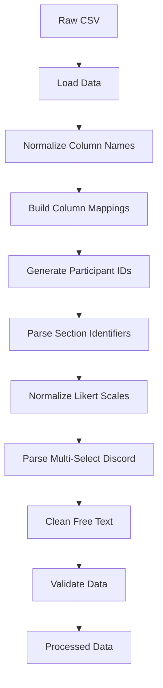
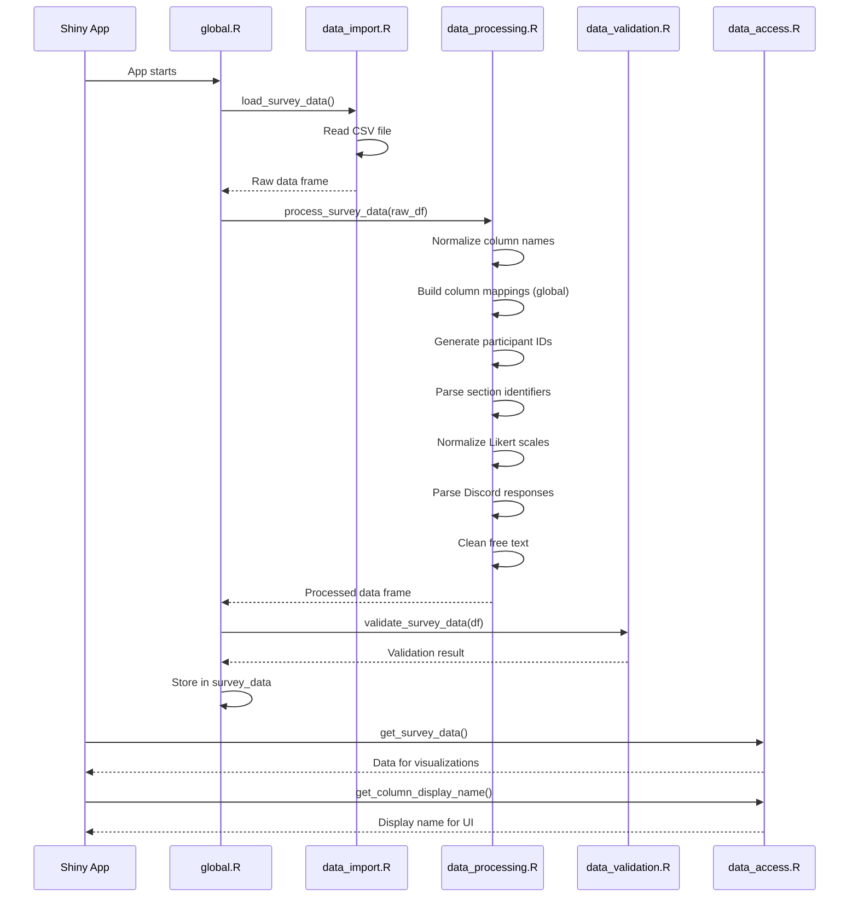

# Data Import and Processing Architecture Design

## Overview

This document outlines the architecture for importing and processing the CPSC Experience Survey data for the Shiny R application.

---

## 1. Data Import Layer

### 1.1 CSV Loading Strategy

**Location**: `R/global.R` (global scope, loaded once at app startup)

**Function**: `load_survey_data()`

**Implementation Details**:
- Use base R `read.csv()` with `stringsAsFactors = FALSE`
- Enable proper handling of multi-line values and escaped quotes
- Validate file existence before loading
- Return `NULL` on failure with error logging

**Rationale**: Loading in `global.R` ensures data is available to all sessions and loaded only once, improving performance.

### 1.2 Package Dependencies

**Required Packages**:
- `dplyr` - Data manipulation
- `stringr` - String operations for cleaning
- `tidyr` - Data reshaping (for multi-select parsing)

**Loading**: Load in `global.R` via `library()` calls

---

## 2. Data Processing Layer

### 2.1 Processing Pipeline

The data processing follows a sequential pipeline:



### 2.2 Core Processing Functions

#### 2.2.1 Column Name Normalization

**Function**: `normalize_column_names(df)`

**Purpose**: Convert column names to lowercase, replace spaces with underscores, remove special characters for programmatic use

**Implementation**:
```r
normalize_column_names <- function(df) {
  original_names <- names(df)
  names(df) <- tolower(names(df))
  names(df) <- gsub("[^a-z0-9_]", "_", names(df))
  names(df) <- gsub("_+", "_", names(df))
  names(df) <- gsub("^_|_$", "", names(df))
  attr(df, "original_column_names") <- original_names
  return(df)
}
```

**Note**: The function temporarily stores original names as an attribute to return them, but this is only used internally to build the global mapping.

#### 2.2.2 Build Column Mappings

**Function**: `build_column_mappings(df)`

**Purpose**: Create a global mapping between normalized column names and original question text for UI display

**Implementation**:
```r
build_column_mappings <- function(df) {
  original_names <- attr(df, "original_column_names")
  if (is.null(original_names)) {
    original_names <- names(df)
  }
  
  column_mappings <<- list(
    original = original_names,
    normalized = names(df)
  )
  
  # Remove the temporary attribute
  attr(df, "original_column_names") <- NULL
  
  return(df)
}
```

**Rationale**: This creates a global `column_mappings` variable that persists across all operations and won't be lost during data transformations.

#### 2.2.3 Get Display Name for Column

**Function**: `get_column_display_name(normalized_name)`

**Purpose**: Retrieve the original column name (question text) for display in UI/charts

**Implementation**:
```r
get_column_display_name <- function(normalized_name) {
  idx <- which(column_mappings$normalized == normalized_name)
  if (length(idx) == 0) {
    return(normalized_name)
  }
  return(column_mappings$original[idx[1]])
}
```

#### 2.2.4 Get All Display Names

**Function**: `get_all_column_display_names()`

**Purpose**: Return a named vector mapping normalized column names to their display names

**Implementation**:
```r
get_all_column_display_names <- function() {
  setNames(column_mappings$original, column_mappings$normalized)
}
```

#### 2.2.5 Participant ID Generation

**Function**: `generate_participant_ids(df)`

**Purpose**: Create synthetic participant IDs using timestamp + section + sequence

**Implementation**:
```r
generate_participant_ids <- function(df) {
  df <- df %>%
    arrange(timestamp, section) %>%
    mutate(
      section_seq = row_number(),
      participant_id = paste0(
        format(as.POSIXct(timestamp, format = "%Y/%m/%d %I:%M:%S %p"), "%Y%m%d%H%M%S"),
        "_",
        ifelse(is.na(section), "UNK", gsub("[^0-9a-zA-Z]", "", section)),
        "_",
        sprintf("%04d", section_seq)
      )
    ) %>%
    select(participant_id, everything(), -section_seq)
  return(df)
}
```

#### 2.2.6 Section Identifier Parsing

**Function**: `parse_section_identifiers(df)`

**Purpose**: Split section column into course_number and time components

**Implementation**:
```r
parse_section_identifiers <- function(df) {
  df <- df %>%
    mutate(
      course_number = ifelse(
        grepl(" - ", section),
        trimws(gsub(" - .*", "", section)),
        NA_character_
      ),
      section_time = ifelse(
        grepl(" - ", section),
        trimws(gsub(".* - ", "", section)),
        NA_character_
      )
    )
  return(df)
}
```

#### 2.2.7 Likert Scale Normalization

**Function**: `normalize_likert_scales(df, likert_columns)`

**Purpose**: Strip non-numeric characters from Likert responses to extract numeric rating (1-5)

**Implementation**:
```r
normalize_likert_scales <- function(df, likert_columns) {
  df <- df %>%
    mutate(across(
      all_of(likert_columns),
      ~ as.integer(gsub("[^0-9]", "", .x))
    ))
  return(df)
}
```

**Likert Column Groups**:
- Course agreement statements: columns 8-13
- Learning elements contribution: columns 14-24
- Community & belonging statements: columns 28-32

#### 2.2.8 Multi-Select Discord Parsing

**Function**: `parse_discord_responses(df)`

**Purpose**: Parse semicolon-separated Discord responses into binary columns

**Implementation**:
```r
parse_discord_responses <- function(df) {
  discord_options <- c(
    "i have joined the class discord",
    "i am active in the class discord",
    "it is really useful for me for learning",
    "it is the main way that i connect with other students in this class",
    "i like that the class discord exists",
    "i don't like the amount of notifications",
    "i'm not sure what its purpose is",
    "i do not use the class discord at all",
    "i never joined it",
    "i did not join"
  )
  
  discord_col <- "about_the_class_discord_select_all_that_apply"
  
  if (!discord_col %in% names(df)) {
    return(df)
  }
  
  # Create binary columns for each option
  for (option in discord_options) {
    col_name <- paste0("discord_", gsub(" ", "_", option))
    df[[col_name]] <- ifelse(
      grepl(option, df[[discord_col]], ignore.case = TRUE),
      1L,
      0L
    )
  }
  
  # Add column for custom responses
  df$discord_custom_response <- ifelse(
    grepl(";", df[[discord_col]]) &
      !any(sapply(discord_options, function(opt) grepl(opt, df[[discord_col]], ignore.case = TRUE))),
    df[[discord_col]],
    NA_character_
  )
  
  return(df)
}
```

#### 2.2.9 Free Text Cleaning

**Function**: `clean_free_text(df, text_columns)`

**Purpose**: Clean free text columns by removing extra whitespace, normalizing line breaks, handling special characters

**Implementation**:
```r
clean_free_text <- function(df, text_columns) {
  df <- df %>%
    mutate(across(
      all_of(text_columns),
      ~ {
        if (is.na(.x)) return(NA_character_)
        .x %>%
          str_trim() %>%
          gsub("\\r\\n|\\r|\\n", " ", .) %>%
          gsub("\\s+", " ", .) %>%
          str_trim()
      }
    ))
  return(df)
}
```

#### 2.2.10 Main Processing Function

**Function**: `process_survey_data(raw_df)`

**Purpose**: Orchestrate all processing steps

**Implementation**:
```r
process_survey_data <- function(raw_df) {
  if (is.null(raw_df)) return(NULL)
  
  df <- raw_df %>%
    normalize_column_names() %>%
    build_column_mappings() %>%
    generate_participant_ids() %>%
    parse_section_identifiers()
  
  # Define column groups
  likert_columns <- c(
    # Course agreement (columns 8-13)
    "how_much_do_you_agree_with_the_statement_1",
    "how_much_do_you_agree_with_the_statement_2",
    "how_much_do_you_agree_with_the_statement_3",
    "how_much_do_you_agree_with_the_statement_4",
    "how_much_do_you_agree_with_the_statement_5",
    "how_much_do_you_agree_with_the_statement_6",
    # Learning elements (columns 14-24)
    "how_much_do_the_following_elements_contribute_to_your_learning_1",
    "how_much_do_the_following_elements_contribute_to_your_learning_2",
    "how_much_do_the_following_elements_contribute_to_your_learning_3",
    "how_much_do_the_following_elements_contribute_to_your_learning_4",
    "how_much_do_the_following_elements_contribute_to_your_learning_5",
    "how_much_do_the_following_elements_contribute_to_your_learning_6",
    "how_much_do_the_following_elements_contribute_to_your_learning_7",
    "how_much_do_the_following_elements_contribute_to_your_learning_8",
    "how_much_do_the_following_elements_contribute_to_your_learning_9",
    "how_much_do_the_following_elements_contribute_to_your_learning_10",
    "how_much_do_the_following_elements_contribute_to_your_learning_11",
    # Community statements (columns 28-32)
    "how_much_do_you_agree_with_the_following_statements_1",
    "how_much_do_you_agree_with_the_following_statements_2",
    "how_much_do_you_agree_with_the_following_statements_3",
    "how_much_do_you_agree_with_the_following_statements_4",
    "how_much_do_you_agree_with_the_following_statements_5"
  )
  
  free_text_columns <- c(
    "how_is_the_course_meeting_your_expectations_for_what_you_hoped_to_learn_or_experience_optional",
    "why_is_this_your_preferred_way_of_learning",
    "optional_if_you_re_not_taking_this_class_in_your_preferred_learning_method_why",
    "thinking_about_what_helps_you_learn_the_best",
    "what_s_been_your_favorite_part_of_the_class_optional",
    "what_s_been_the_least_enjoyable_part_optional",
    "what_s_the_greatest_challenge_in_meeting_new_people_optional",
    "please_remark_on_aspects_of_the_class_that_make_it_welcoming_optional",
    "what_were_your_expectations_hopes_for_interacting_with_the_other_students_optional",
    "what_were_your_expectations_hopes_for_interacting_with_the_professor_optional",
    "any_other_comments_optional"
  )
  
  df <- df %>%
    normalize_likert_scales(likert_columns) %>%
    parse_discord_responses() %>%
    clean_free_text(free_text_columns)
  
  return(df)
}
```

---

## 3. Data Structure Design

### 3.1 Primary Data Frame

**Name**: `survey_data`

**Structure**: Single data frame containing all processed data

**Key Columns**:
- `participant_id` - Synthetic unique identifier (primary key)
- `timestamp` - Original response timestamp
- `section` - Original section identifier
- `course_number` - Parsed course number (e.g., "231", "217")
- `section_time` - Parsed time slot (e.g., "1pm", "11am")
- `prior_programming_experience` - Programming experience level
- `learning_preference` - In-person/Online/No preference
- Likert scale columns (normalized to integers 1-5)
- Discord binary columns (one per option)
- Free text columns (cleaned)

### 3.2 Global Column Mappings

**Name**: `column_mappings`

**Structure**: List with two character vectors

```r
column_mappings <- list(
  original = c("Timestamp", "What section are you in?", ...),
  normalized = c("timestamp", "what_section_are_you_in", ...)
)
```

**Purpose**: Stores the mapping between normalized column names (for programmatic use) and original question text (for UI display)

**Access Functions**:
- `get_column_display_name(normalized_name)` - Get display name for a single column
- `get_all_column_display_names()` - Get all mappings as a named vector

### 3.3 Data Access Functions

#### 3.3.1 Get All Data

**Function**: `get_survey_data()`

**Purpose**: Return the full processed data frame

#### 3.3.2 Filter by Section

**Function**: `get_data_by_section(course_number, section_time)`

**Purpose**: Return data filtered by course and time slot

#### 3.3.3 Get Likert Data

**Function**: `get_likert_data(category)`

**Purpose**: Return only Likert scale columns for a specific category (course/learning/community)

#### 3.3.4 Get Free Text Responses

**Function**: `get_free_text_responses(question_column)`

**Purpose**: Return non-empty responses for a specific free text question

#### 3.3.5 Get Discord Statistics

**Function**: `get_discord_stats()`

**Purpose**: Return summary statistics for Discord usage

#### 3.3.6 Get Column Display Name

**Function**: `get_column_display_name(normalized_name)`

**Purpose**: Retrieve the original column name (question text) for UI display

#### 3.3.7 Get All Display Names

**Function**: `get_all_column_display_names()`

**Purpose**: Return a named vector mapping normalized column names to their display names

### 3.4 Data Organization for Visualizations

**Approach**: Single data frame with accessor functions

**Rationale**:
- Simpler to maintain than multiple data frames
- Consistent data source across all visualizations
- Easy to filter/subset as needed
- Avoids data synchronization issues

---

## 4. Error Handling

### 4.1 Data Loading Errors

**Strategy**: Graceful degradation with logging

**Implementation**:
```r
load_survey_data <- function() {
  tryCatch({
    if (!file.exists("survey_data/CPSC Experience Survey.csv")) {
      stop("Survey data file not found")
    }
    
    df <- read.csv("survey_data/CPSC Experience Survey.csv", 
                   stringsAsFactors = FALSE,
                   quote = "\"",
                   comment.char = "")
    
    if (nrow(df) == 0) {
      stop("Survey data file is empty")
    }
    
    return(df)
  }, error = function(e) {
    message("ERROR loading survey data: ", e$message)
    return(NULL)
  })
}
```

### 4.2 Data Validation

**Function**: `validate_survey_data(df)`

**Checks**:
- Required columns exist
- No duplicate participant IDs

**Implementation**:
```r
validate_survey_data <- function(df) {
  if (is.null(df)) {
    return(list(valid = FALSE, errors = "Data is NULL"))
  }
  
  errors <- c()
  
  # Check for required columns
  required_cols <- c("timestamp", "section", "participant_id")
  missing_cols <- setdiff(required_cols, names(df))
  if (length(missing_cols) > 0) {
    errors <- c(errors, paste("Missing required columns:", paste(missing_cols, collapse = ", ")))
  }
  
  # Check for duplicate participant IDs
  if ("participant_id" %in% names(df)) {
    dup_ids <- df$participant_id[duplicated(df$participant_id)]
    if (length(dup_ids) > 0) {
      errors <- c(errors, paste("Duplicate participant IDs found:", length(dup_ids)))
    }
  }
  
  return(list(
    valid = length(errors) == 0,
    errors = errors
  ))
}
```

### 4.3 Error Reporting

**Strategy**: Log to console, display in app if critical

**Implementation**:
- Use `message()` for warnings
- Use `stop()` for critical errors
- In Shiny app, display error messages in UI if data loading fails

---

## 5. Code Organization

### 5.1 File Structure

```
R/
├── global.R                          # Global variables, data loading, initialization
├── data/
│   ├── data_import.R                 # Data loading functions
│   ├── data_processing.R             # Data transformation functions
│   ├── data_validation.R             # Data validation functions
│   └── data_access.R                 # Data accessor functions
├── utils/
│   └── utility_functions.R           # General utility functions
└── [other modules...]
```

### 5.2 File Responsibilities

#### `R/global.R`
- Load required packages
- Define global constants (file paths, column mappings)
- Initialize global `column_mappings` variable
- Call data loading and processing at startup
- Store processed data in global variable `survey_data`
- Define free text question mappings

#### `R/data/data_import.R`
- `load_survey_data()` - Load CSV file
- `validate_file_exists()` - Check file existence
- Error handling for file operations

#### `R/data/data_processing.R`
- `normalize_column_names()` - Column name normalization
- `build_column_mappings()` - Build global column name mappings
- `generate_participant_ids()` - ID generation
- `parse_section_identifiers()` - Section parsing
- `normalize_likert_scales()` - Likert normalization
- `parse_discord_responses()` - Multi-select parsing
- `clean_free_text()` - Text cleaning
- `process_survey_data()` - Main processing orchestration

#### `R/data/data_validation.R`
- `validate_survey_data()` - Comprehensive validation

#### `R/data/data_access.R`
- `get_survey_data()` - Get full data
- `get_data_by_section()` - Filter by section
- `get_likert_data()` - Get Likert columns by category
- `get_free_text_responses()` - Get free text for question
- `get_discord_stats()` - Discord usage statistics
- `get_statistics()` - General statistics for home page
- `get_column_display_name()` - Get display name for a column
- `get_all_column_display_names()` - Get all display name mappings

### 5.3 Naming Conventions

**Functions**: `snake_case` (e.g., `load_survey_data`, `parse_section_identifiers`)

**Variables**: `snake_case` (e.g., `survey_data`, `likert_columns`)

**Constants**: `UPPER_SNAKE_CASE` (e.g., `SURVEY_FILE_PATH`)

**Data Frame Columns**: `snake_case` (e.g., `participant_id`, `course_number`)

### 5.4 Modularization Principles

1. **Single Responsibility**: Each function does one thing well
2. **Pure Functions**: Processing functions should not have side effects (except `build_column_mappings` which updates global state)
3. **Composability**: Functions can be chained with pipe operator (`%>%`)
4. **Testability**: Functions are isolated and can be unit tested
5. **Documentation**: Each function has clear purpose and parameter documentation

---

## 6. Column Mapping Reference

### 6.1 Likert Scale Columns

**Course Agreement Statements (Columns 8-13)**:
- `how_much_do_you_agree_with_the_statement_1` through `6`

**Learning Elements Contribution (Columns 14-24)**:
- `how_much_do_the_following_elements_contribute_to_your_learning_1` through `11`

**Community & Belonging Statements (Columns 28-32)**:
- `how_much_do_you_agree_with_the_following_statements_1` through `5`

### 6.2 Free Text Columns

**Expectations & Learning (Columns 4, 6, 7)**:
- `how_is_the_course_meeting_your_expectations_for_what_you_hoped_to_learn_or_experience_optional`
- `why_is_this_your_preferred_way_of_learning`
- `optional_if_you_re_not_taking_this_class_in_your_preferred_learning_method_why`

**Course Experience (Columns 25-27)**:
- `thinking_about_what_helps_you_learn_the_best`
- `what_s_been_your_favorite_part_of_the_class_optional`
- `what_s_been_the_least_enjoyable_part_optional`

**Social & Inclusivity (Columns 33, 35-38)**:
- `what_s_the_greatest_challenge_in_meeting_new_people_optional`
- `please_remark_on_aspects_of_the_class_that_make_it_welcoming_optional`
- `what_were_your_expectations_hopes_for_interacting_with_the_other_students_optional`
- `what_were_your_expectations_hopes_for_interacting_with_the_professor_optional`
- `any_other_comments_optional`

### 6.3 Discord Binary Columns

Generated from column 34:
- `discord_i_have_joined_the_class_discord`
- `discord_i_am_active_in_the_class_discord`
- `discord_it_is_really_useful_for_me_for_learning`
- `discord_it_is_the_main_way_that_i_connect_with_other_students_in_this_class`
- `discord_i_like_that_the_class_discord_exists`
- `discord_i_don_t_like_the_amount_of_notifications`
- `discord_i_m_not_sure_what_its_purpose_is`
- `discord_i_do_not_use_the_class_discord_at_all`
- `discord_i_never_joined_it`
- `discord_i_did_not_join`
- `discord_custom_response`

---

## 7. Processing Flow Summary



---

## 8. Constants and Configuration

### 8.1 File Paths

```r
SURVEY_FILE_PATH <- "survey_data/CPSC Experience Survey.csv"
```

### 8.2 Discord Options

```r
DISCORD_OPTIONS <- c(
  "i have joined the class discord",
  "i am active in the class discord",
  "it is really useful for me for learning",
  "it is the main way that i connect with other students in this class",
  "i like that the class discord exists",
  "i don't like the amount of notifications",
  "i'm not sure what its purpose is",
  "i do not use the class discord at all",
  "i never joined it",
  "i did not join"
)
```

---

## 9. Migration from Existing Code

### 9.1 Changes Required

1. **Replace `load_data()`** with new `load_survey_data()` and `process_survey_data()`
2. **Update column mappings** in `global.R` to match new column names
3. **Replace `generate_response_ids()`** with `generate_participant_ids()`
4. **Update `get_responses_for_question()`** to use new column names
5. **Update `get_participant_profile()`** to use `participant_id` instead of `response_id`
6. **Add new accessor functions** for section filtering, Likert data, Discord stats
7. **Update UI code** to use `get_column_display_name()` for displaying question text

---

## 10. Future Considerations

### 10.1 Performance

- Data is loaded once at startup (already optimal)
- Use vectorized operations (dplyr) for efficiency

### 10.2 Documentation

- Add roxygen2 documentation to all functions
- Include examples in function documentation
- Maintain this architecture document as reference
