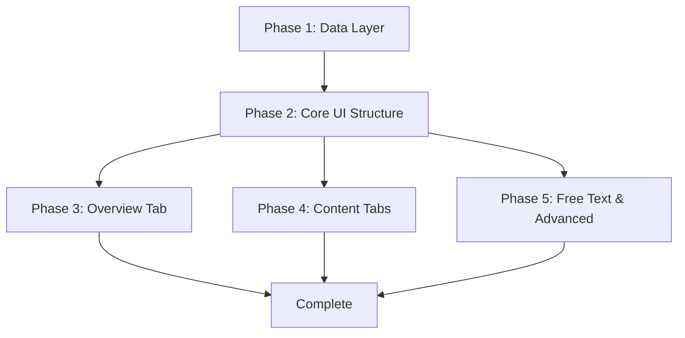

# Comprehensive Refactor Plan

## Executive Summary

This refactor plan combines the data import/processing architecture and visualization/presentation architecture into a unified implementation strategy for the CPSC Experience Survey Shiny application.

### Refactoring Goals

1. **Modernize Data Pipeline**: Replace ad-hoc data loading with a structured, modular data import and processing system
2. **Create Comprehensive UI**: Implement 5 focused tabs (Overview, Course Content, Learning Elements, Community & Belonging, Free Text Responses)
3. **Add Comparison Features**: Enable section, experience level, and learning preference comparisons across all data
4. **Implement Statistics & Insights**: Add statistical analysis and automated insights generation
5. **Improve User Experience**: Consistent styling, participant profile modal, and responsive design

### Scope

- Complete restructure of data layer (import, processing, validation, access)
- New UI components for all 5 tabs
- Reusable comparison controls and insights panel
- Enhanced participant profile modal
- Statistical analysis capabilities
- Automated testing infrastructure

---

## Implementation Phases

### Phase 1: Data Layer Foundation

**Objective**: Establish a robust, modular data pipeline that serves as the foundation for all visualizations.

**Dependencies**: None (can start immediately)

**Deliverables**:
- New data import module with error handling
- New data processing module with all transformation functions
- New data validation module
- New data access module with comprehensive accessor functions
- Updated global.R to use new data pipeline
- Automated tests for all data functions

**Key Functions**:
- `load_survey_data()` - CSV loading with validation
- `process_survey_data()` - Main processing orchestration
- `normalize_column_names()` - Column name normalization
- `build_column_mappings()` - Global column name mappings
- `generate_participant_ids()` - Synthetic ID generation
- `parse_section_identifiers()` - Section parsing
- `normalize_likert_scales()` - Likert scale normalization
- `parse_discord_responses()` - Multi-select parsing
- `clean_free_text()` - Text cleaning
- `validate_survey_data()` - Data validation
- `get_survey_data()` - Full data access
- `get_data_by_section()` - Section filtering
- `get_likert_data()` - Likert data access
- `get_free_text_responses()` - Free text access
- `get_discord_stats()` - Discord statistics
- `get_column_display_name()` - Display name lookup
- `get_all_column_display_names()` - All display names

---

### Phase 2: Core UI Structure

**Objective**: Create the foundational UI components and tab structure.

**Dependencies**: Phase 1 (data layer must be functional)

**Deliverables**:
- New tab UI files for all 5 tabs
- Reusable comparison controls component
- Reusable insights panel component
- Updated main UI to include new tabs
- Automated tests for UI components

**Key Components**:
- `ui_overview_tab.R` - Overview tab structure
- `ui_course_content_tab.R` - Course Content tab structure
- `ui_learning_elements_tab.R` - Learning Elements tab structure
- `ui_community_tab.R` - Community & Belonging tab structure
- `ui_free_text_tab.R` - Free Text Responses tab structure
- `ui_comparison_controls.R` - Reusable comparison controls
- `ui_insights_panel.R` - Reusable insights panel
- `ui_participant_modal.R` - Participant profile modal

---

### Phase 3: Overview Tab Implementation

**Objective**: Implement the Overview tab with context visualizations, key metrics, and quick insights.

**Dependencies**: Phase 1 (data), Phase 2 (UI structure)

**Deliverables**:
- Context & demographics visualizations
- Key metrics dashboard
- Quick insights generation
- Server logic for overview tab
- Automated tests for overview functionality

**Key Visualizations**:
- Section distribution bar chart
- Programming experience horizontal bar chart
- Response timeline (optional)
- Learning preference stacked bar chart
- Course agreement diverging stacked bar chart
- Expectations met gauge chart

---

### Phase 4: Content Tabs Implementation

**Objective**: Implement the three content-focused tabs with their respective visualizations.

**Dependencies**: Phase 1 (data), Phase 2 (UI structure)

**Deliverables**:
- Course Content tab with all visualizations
- Learning Elements tab with all visualizations
- Community & Belonging tab with all visualizations
- Server logic for all three tabs
- Plot generation functions
- Automated tests for all content tabs

**Course Content Visualizations**:
- Likert heatmap for 6 agreement statements
- Statement rankings horizontal bar chart
- Section comparison grouped bar chart
- Experience comparison grouped bar chart

**Learning Elements Visualizations**:
- Element rankings horizontal bar chart
- Element distribution diverging stacked bar chart
- Correlation matrix heatmap
- Experience-based small multiples

**Community & Belonging Visualizations**:
- Belonging statements diverging stacked bar chart
- Belonging score gauge chart
- Discord feature usage horizontal bar chart
- Discord usage patterns stacked bar chart
- Section comparison grouped bar chart

---

### Phase 5: Free Text & Advanced Features

**Objective**: Implement the Free Text tab, enhanced participant modal, and statistical analysis features.

**Dependencies**: Phase 1 (data), Phase 2 (UI structure)

**Deliverables**:
- Free Text Responses tab with question selector and response browser
- Enhanced participant profile modal
- Statistical calculations module
- Insights generation module
- Server logic for free text and statistics
- Automated tests for all advanced features

**Key Features**:
- Question selector for all free text questions
- Response browser with filtering
- Participant profile modal with all responses
- Descriptive statistics calculations
- Distribution analysis
- Correlation analysis
- Chi-square tests
- ANOVA tests
- Effect size calculations
- Automated insights generation

---

## File Changes

### Files to Create

#### Data Layer (Phase 1)
```
R/data/data_import.R
R/data/data_processing.R
R/data/data_validation.R
R/data/data_access.R
```

#### UI Components (Phase 2)
```
R/ui/ui_overview_tab.R
R/ui/ui_course_content_tab.R
R/ui/ui_learning_elements_tab.R
R/ui/ui_community_tab.R
R/ui/ui_free_text_tab.R
R/ui/ui_comparison_controls.R
R/ui/ui_insights_panel.R
R/ui/ui_participant_modal.R
```

#### Visualization Layer (Phases 3-5)
```
R/visualization/likert_plots.R
R/visualization/comparison_plots.R
R/visualization/statistics_plots.R
R/visualization/text_visualizations.R
```

#### Server Logic (Phases 3-5)
```
R/server/server_comparisons.R
R/server/server_insights.R
```

#### Utility Functions (Phases 3-5)
```
R/utils/label_formatter.R
R/utils/statistics_calculator.R
R/utils/insights_generator.R
```

#### Tests (All Phases)
```
tests/testthat/test_data_import.R
tests/testthat/test_data_processing.R
tests/testthat/test_data_validation.R
tests/testthat/test_data_access.R
tests/testthat/test_statistics_calculator.R
tests/testthat/test_insights_generator.R
```

### Files to Modify

#### Core Application Files
```
R/global.R                    - Update to use new data pipeline
R/ui/ui_main.R                - Update to include new tabs
R/server/server_main.R        - Update to handle new tabs
R/server/server_plots.R       - Update with new plot functions
R/server/server_statistics.R  - Update with new statistics functions
R/server/server_responses.R   - Update with new response handling
R/visualization/plot_generation.R - Update with new plot generation functions
R/utils/utility_functions.R   - Update with new utility functions
```

#### Configuration Files
```
app.R                         - Update if needed for new structure
```

### Files to Delete

```
R/ui/ui_home_tab.R            - Replaced by ui_overview_tab.R
R/ui/ui_question_responses_tab.R - Replaced by ui_free_text_tab.R
```

---

## Implementation Order

### Sequential Order

1. **Phase 1: Data Layer Foundation**
   - Create all data layer files
   - Update global.R
   - Write and run automated tests
   - Verify data pipeline works end-to-end

2. **Phase 2: Core UI Structure**
   - Create all new UI component files
   - Update ui_main.R
   - Write automated tests for UI components
   - Verify UI structure renders correctly

3. **Phase 3: Overview Tab Implementation**
   - Create plot generation functions for overview
   - Implement server logic for overview
   - Write automated tests
   - Verify overview tab works

4. **Phase 4: Content Tabs Implementation**
   - Create plot generation functions for content tabs
   - Implement server logic for content tabs
   - Write automated tests
   - Verify all content tabs work

5. **Phase 5: Free Text & Advanced Features**
   - Create utility functions for statistics and insights
   - Implement free text tab logic
   - Implement participant modal enhancements
   - Write automated tests
   - Verify all advanced features work

### Dependency Graph



---

## Git Commit Strategy

### Commit Frequency

**After Each Phase**: Commit all changes for a phase together with a descriptive message.

**Within a Phase**: For larger phases (Phase 4 and 5), consider intermediate commits after completing major components.

### Commit Message Format

```
<type>(<scope>): <subject>

<body>

<footer>
```

**Types**:
- `feat`: New feature
- `fix`: Bug fix
- `refactor`: Code refactoring
- `test`: Adding or updating tests
- `docs`: Documentation changes
- `style`: Code style changes (formatting, etc.)

### Example Commits

**Phase 1**:
```
feat(data): implement data import and processing pipeline

- Add data_import.R with load_survey_data() function
- Add data_processing.R with all transformation functions
- Add data_validation.R with validation logic
- Add data_access.R with comprehensive accessor functions
- Update global.R to use new data pipeline
- Add automated tests for all data functions

Closes #1
```

**Phase 2**:
```
feat(ui): create core UI structure for new tabs

- Add ui_overview_tab.R for overview tab
- Add ui_course_content_tab.R for course content tab
- Add ui_learning_elements_tab.R for learning elements tab
- Add ui_community_tab.R for community tab
- Add ui_free_text_tab.R for free text tab
- Add ui_comparison_controls.R for reusable comparison controls
- Add ui_insights_panel.R for reusable insights panel
- Add ui_participant_modal.R for participant profile modal
- Update ui_main.R to include new tabs
- Add automated tests for UI components

Closes #2
```

**Phase 3**:
```
feat(overview): implement overview tab with visualizations

- Add context visualizations (section distribution, experience)
- Add key metrics dashboard
- Add quick insights generation
- Implement server logic for overview tab
- Add automated tests for overview functionality

Closes #3
```

**Phase 4**:
```
feat(content): implement course content, learning elements, and community tabs

- Add course content visualizations (likert heatmap, rankings, comparisons)
- Add learning elements visualizations (rankings, distribution, correlation)
- Add community visualizations (belonging, discord, comparisons)
- Implement server logic for all three tabs
- Add plot generation functions
- Add automated tests for all content tabs

Closes #4
```

**Phase 5**:
```
feat(advanced): implement free text tab and advanced features

- Add free text responses tab with question selector
- Add enhanced participant profile modal
- Add statistical calculations module
- Add insights generation module
- Implement server logic for free text and statistics
- Add automated tests for all advanced features

Closes #5
```

### Branch Strategy

- Work on feature branch: `refactor`
- Create phase-specific branches if needed: `refactor/phase-1`, `refactor/phase-2`, etc.
- Merge phase branches back to `refactor` after completion
- Final merge to `main` after all phases complete

---

## Testing Strategy

### Automated Testing Approach

All features will be developed with automated tests that can run without user intervention, enabling iterative development until correctness is achieved.

### Test Framework

- **Framework**: `testthat` (standard R testing framework)
- **Test Runner**: `devtools::test()` or `testthat::test_dir()`
- **Coverage**: `covr` package for code coverage reporting

### Test Organization

```
tests/
├── testthat/
│   ├── test_data_import.R
│   ├── test_data_processing.R
│   ├── test_data_validation.R
│   ├── test_data_access.R
│   ├── test_statistics_calculator.R
│   ├── test_insights_generator.R
│   └── helper.R
└── testthat.R
```

### Test Categories

#### 1. Unit Tests (Data Layer)

**Purpose**: Test individual functions in isolation

**Coverage**:
- `test_data_import.R`: Test CSV loading, error handling, file validation
- `test_data_processing.R`: Test each transformation function
- `test_data_validation.R`: Test validation logic and error detection
- `test_data_access.R`: Test all accessor functions

**Example Test Structure**:
```r
test_that("normalize_column_names converts to lowercase and replaces spaces", {
  df <- data.frame("Column One" = c(1, 2), "Column Two" = c(3, 4))
  result <- normalize_column_names(df)
  expect_equal(names(result), c("column_one", "column_two"))
})

test_that("load_survey_data returns NULL for non-existent file", {
  result <- load_survey_data("non_existent.csv")
  expect_null(result)
})
```

#### 2. Integration Tests (Data Pipeline)

**Purpose**: Test the complete data pipeline from import to access

**Coverage**:
- End-to-end data loading and processing
- Column mappings persistence
- Data validation after processing
- Accessor functions return correct data

**Example Test Structure**:
```r
test_that("complete data pipeline produces valid survey data", {
  raw_df <- load_survey_data("test_data.csv")
  processed_df <- process_survey_data(raw_df)
  validation <- validate_survey_data(processed_df)
  
  expect_true(validation$valid)
  expect_true("participant_id" %in% names(processed_df))
  expect_true("course_number" %in% names(processed_df))
})
```

#### 3. Unit Tests (Statistics & Insights)

**Purpose**: Test statistical calculations and insights generation

**Coverage**:
- `test_statistics_calculator.R`: Test all statistical functions
- `test_insights_generator.R`: Test insights generation logic

**Example Test Structure**:
```r
test_that("calculate_mean_difference returns correct difference", {
  df <- data.frame(
    group = c("A", "A", "B", "B"),
    value = c(1, 3, 2, 4)
  )
  result <- calculate_mean_difference(df, "group", "value")
  expect_equal(result$mean_A, 2)
  expect_equal(result$mean_B, 3)
  expect_equal(result$difference, 1)
})
```

#### 4. Visual Regression Tests (Optional)

**Purpose**: Ensure plot outputs remain consistent

**Coverage**:
- Plot generation functions produce expected outputs
- Plot dimensions and structure are correct

**Example Test Structure**:
```r
test_that("generate_likert_bar_plot returns a ggplot object", {
  df <- data.frame(
    response = c("Strongly Agree", "Agree", "Neutral", "Disagree", "Strongly Disagree"),
    count = c(10, 20, 5, 3, 2)
  )
  result <- generate_likert_bar_plot(df, "response", "count", "Test Plot")
  expect_s3_class(result, "ggplot")
})
```

### Test Data

**Location**: `tests/testthat/fixtures/`

**Files**:
- `sample_survey_data.csv` - Small sample dataset for testing
- `expected_processed_data.rds` - Expected output after processing

### Running Tests

**Run all tests**:
```r
devtools::test()
```

**Run specific test file**:
```r
testthat::test_file("tests/testthat/test_data_processing.R")
```

**Run tests with coverage**:
```r
covr::package_coverage()
```

### Continuous Testing

**During Development**:
- Run tests after each function implementation
- Fix failing tests before proceeding
- Aim for high code coverage (>80%)

**Before Commit**:
- Run full test suite
- Ensure all tests pass
- Check coverage report

### Test-Driven Development Workflow

1. Write a failing test for the desired functionality
2. Implement the minimum code to make the test pass
3. Run tests to verify
4. Refactor if needed
5. Repeat for next feature

This approach ensures:
- Code is testable from the start
- Tests serve as documentation
- Regression bugs are caught early
- Developer can iterate until tests pass

---

## Migration from Existing Code

### Key Changes Required

1. **Replace `load_data()`** with new `load_survey_data()` and `process_survey_data()`
2. **Update column mappings** in `global.R` to match new column names
3. **Replace `generate_response_ids()`** with `generate_participant_ids()`
4. **Update `get_responses_for_question()`** to use new column names
5. **Update `get_participant_profile()`** to use `participant_id` instead of `response_id`
6. **Add new accessor functions** for section filtering, Likert data, Discord stats
7. **Update UI code** to use `get_column_display_name()` for displaying question text

### Migration Checklist

- [ ] Backup existing code
- [ ] Create new data layer files
- [ ] Update global.R
- [ ] Run automated tests for data layer
- [ ] Create new UI files
- [ ] Update ui_main.R
- [ ] Run automated tests for UI components
- [ ] Implement each tab sequentially
- [ ] Run automated tests after each tab
- [ ] Delete old UI files
- [ ] Final integration testing
- [ ] Deploy and verify

---

## Summary

This refactor plan provides a structured approach to modernizing the CPSC Experience Survey Shiny application. The implementation is divided into 5 sequential phases, each building on the previous one:

1. **Phase 1**: Data Layer Foundation - Robust data pipeline
2. **Phase 2**: Core UI Structure - Foundational UI components
3. **Phase 3**: Overview Tab - High-level summary
4. **Phase 4**: Content Tabs - Detailed analysis views
5. **Phase 5**: Free Text & Advanced Features - Enhanced functionality

The plan includes:
- Clear file change inventory (25 new files, 8 modified, 2 deleted)
- Sequential implementation order with dependencies
- Git commit strategy with descriptive messages
- Automated testing strategy for iterative development
- Migration checklist for transitioning from existing code

Following this plan will result in a well-structured, maintainable, and feature-rich survey analysis application.
