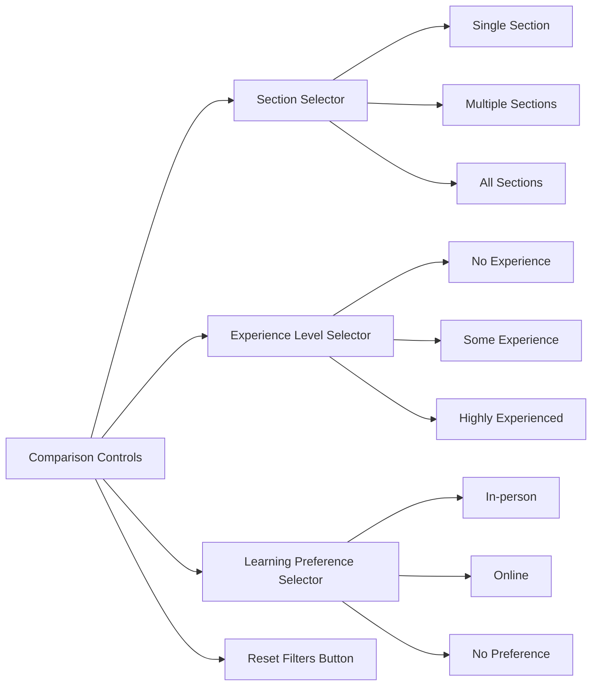
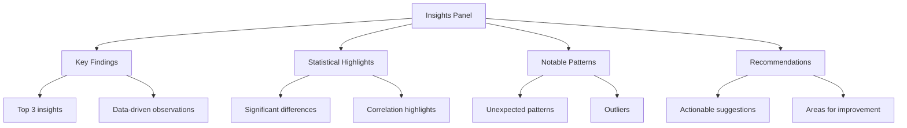
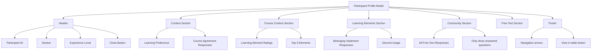
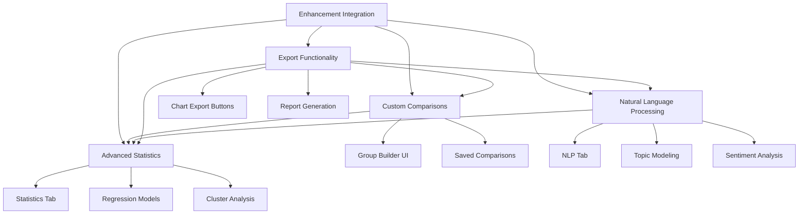

# Visualization and Presentation Architecture Design

## Overview

This document outlines the comprehensive visualization and presentation architecture for the CPSC Experience Survey Shiny application. The design ensures comprehensive coverage of all data sections, consistent styling, statistics-informed insights, and flexible comparison capabilities.

---

## 1. Page/Tab Structure

### 1.1 Tab Navigation

The application will have 5 focused tabs, each with a clear purpose:

```mermaid
flowchart TD
    A[Survey Explorer] --> B[Overview]
    A --> C[Course Content]
    A --> D[Learning Elements]
    A --> E[Community & Belonging]
    A --> F[Free Text Responses]
    
    B --> B1[Context & Demographics]
    B --> B2[Key Metrics Dashboard]
    B --> B3[Quick Insights]
    
    C --> C1[Course Agreement Statements]
    C --> C2[Expectations & Preferences]
    C --> C3[Section Comparisons]
    
    D --> D1[Learning Contribution Rankings]
    D --> D2[Method Effectiveness Analysis]
    D --> D3[Experience-Based Comparisons]
    
    E --> E1[Belonging Statements]
    E --> E2[Discord Engagement]
    E --> E3[Social Challenges]
    
    F --> F1[Question Selector]
    F --> F2[Response Browser]
    F --> F3[Participant Profiles]
```



### 1.2 Tab Descriptions

| Tab | Purpose | Key Content |
|-----|---------|-------------|
| **Overview** | High-level summary of all survey data | Context info, key metrics, quick insights |
| **Course Content** | Course expectations and agreement statements | 6 Likert statements, learning preferences |
| **Learning Elements** | Learning method effectiveness analysis | 11 learning elements, contribution rankings |
| **Community & Belonging** | Social aspects and community engagement | 5 belonging statements, Discord usage |
| **Free Text Responses** | Browse all open-ended responses | All free text questions, participant profiles |

---

## 2. Visualization Types by Data Section

### 2.1 Context & Demographics (Columns 1-3)

| Data Type | Visualization | Description |
|-----------|---------------|-------------|
| **Section Distribution** | Interactive Bar Chart | Shows count per section with click-to-filter |
| **Programming Experience** | Horizontal Bar Chart | Ordered by experience level |
| **Response Timeline** | Time Series (Optional) | Shows response volume over time |

### 2.2 Course Expectations & Learning Preferences (Columns 4-7)

| Data Type | Visualization | Description |
|-----------|---------------|-------------|
| **Learning Preference** | Stacked Bar Chart | In-person vs Online vs No preference |
| **Course Agreement Statements** (6 Likert) | Diverging Stacked Bar Chart | Shows distribution across 1-5 scale for each statement |
| **Expectations Met** | Gauge/Meter Chart | Overall satisfaction score |

### 2.3 Course Content Agreement Statements (Columns 8-13)

| Data Type | Visualization | Description |
|-----------|---------------|-------------|
| **Individual Statement Distribution** | Likert Heatmap | 6 statements × 5 response levels |
| **Statement Rankings** | Horizontal Bar Chart | Average score per statement, ordered |
| **Section Comparison** | Grouped Bar Chart | Compare statement scores across sections |
| **Experience Comparison** | Grouped Bar Chart | Compare by programming experience |

### 2.4 Learning Elements Contribution (Columns 14-24)

| Data Type | Visualization | Description |
|-----------|---------------|-------------|
| **Element Rankings** | Horizontal Bar Chart | Top 11 elements by average rating |
| **Element Distribution** | Diverging Stacked Bar Chart | Distribution for each element |
| **Correlation Matrix** | Heatmap | Shows relationships between elements |
| **Experience-Based Analysis** | Small Multiples | Element ratings by experience level |

### 2.5 Course Experience Feedback (Columns 25-27)

| Data Type | Visualization | Description |
|-----------|---------------|-------------|
| **Sentiment Analysis** | Sentiment Bar Chart | Positive/neutral/negative distribution |
| **Key Themes** | Thematic Bar Chart | Top recurring themes |

### 2.6 Community & Belonging Statements (Columns 28-32)

| Data Type | Visualization | Description |
|-----------|---------------|-------------|
| **Belonging Statements** | Diverging Stacked Bar Chart | 5 statements distribution |
| **Belonging Score** | Gauge Chart | Overall belonging score |
| **Section Comparison** | Grouped Bar Chart | Compare belonging across sections |

### 2.7 Social Challenges (Column 33)

| Data Type | Visualization | Description |
|-----------|---------------|-------------|
| **Challenge Themes** | Thematic Bar Chart | Top challenge categories |

### 2.8 Class Discord Usage (Column 34)

| Data Type | Visualization | Description |
|-----------|---------------|-------------|
| **Discord Feature Usage** | Horizontal Bar Chart | Percentage using each feature |
| **Usage Patterns** | Stacked Bar Chart | Multi-select combinations |
| **Section Comparison** | Grouped Bar Chart | Discord usage by section |

### 2.9 Inclusivity & Interaction Feedback (Columns 35-38)

| Data Type | Visualization | Description |
|-----------|---------------|-------------|
| **Inclusivity Themes** | Thematic Bar Chart | Top inclusivity themes |
| **Interaction Expectations** | Paired Bar Chart | Student vs Professor expectations |

---

## 3. Comparison Features

### 3.1 Comparison Controls

Each tab will have a consistent comparison control panel:



### 3.2 Comparison Visualizations

| Comparison Type | Visualization | Use Case |
|----------------|---------------|----------|
| **Section vs Section** | Grouped Bar Chart | Compare metrics across sections |
| **Experience Level** | Small Multiples | Show same chart for each experience level |
| **Learning Preference** | Faceted Charts | Side-by-side comparison |
| **Multi-Group** | Heatmap | Compare multiple dimensions |

### 3.3 Comparison Workflow

1. User selects comparison dimension (Section, Experience, or Preference)
2. User selects specific groups to compare (or "All")
3. Charts update to show comparison view
4. Statistical significance indicators appear where applicable
5. User can click on any group to drill down

---

## 4. Statistics & Insights

### 4.1 Statistical Analyses

| Analysis Type | Description | Applicable Data |
|---------------|-------------|-----------------|
| **Descriptive Statistics** | Mean, median, mode, SD, quartiles | All numeric data |
| **Distribution Analysis** | Histograms, density plots | Likert scales |
| **Correlation Analysis** | Pearson/Spearman correlations | Learning elements |
| **Chi-Square Test** | Test independence between categorical variables | Section vs Experience |
| **ANOVA** | Compare means across groups | Section comparisons |
| **Effect Size** | Cohen's d, eta-squared | Group comparisons |

### 4.2 Insights Presentation

Each tab will have an "Insights" panel showing:



### 4.3 Statistical Test Selection

| Comparison | Test | When to Use |
|------------|------|-------------|
| Two groups (numeric) | t-test | Section A vs Section B |
| Multiple groups (numeric) | ANOVA | All sections comparison |
| Categorical association | Chi-square | Experience vs Preference |
| Correlation | Pearson | Linear relationship |
| Correlation (ordinal) | Spearman | Likert scale correlations |

---

## 5. Participant Profile Modal

### 5.1 Modal Structure

The participant profile modal will display all responses for a selected participant:



### 5.2 Free Text Handling

- **Optional questions**: Only display if participant provided a response
- **Empty responses**: Do not show placeholder text
- **Formatting**: Preserve line breaks and paragraph structure
- **Truncation**: Show full text with expand/collapse for long responses

### 5.3 Modal Features

- **Navigation**: Previous/Next participant buttons
- **Context**: Show participant's section and experience level
- **Visual indicators**: Color-coded Likert responses
- **Responsive**: Works on mobile and desktop
- **Printable**: Clean print layout option

---

## 6. Styling & Labels

### 6.1 Label Formatting Rules

| Rule | Example | Notes |
|------|---------|-------|
| **Proper Case** | "Learning Preference" | Not "learning preference" |
| **No Periods Between Words** | "Course Content" | Not "Course.Content" |
| **Likert Labels** | "Strongly Agree" | Full text labels, not numbers |
| **Section Labels** | "231 - 1pm" | Preserve original format |

### 6.2 Color Scheme

Inspired by Anthropic's design aesthetic: clean, sophisticated, warm neutrals with subtle accents.

| Purpose | Color | Hex | Description |
|---------|-------|-----|-------------|
| **Primary** | Warm Taupe | `#8B7355` | Sophisticated brown-taupe |
| **Primary Dark** | Deep Brown | `#5D4E37` | Darker shade for hover states |
| **Primary Light** | Light Tan | `#C4A77D` | Lighter shade for backgrounds |
| **Secondary** | Warm Gray | `#6B6B6B` | Neutral gray with warm undertone |
| **Secondary Dark** | Charcoal | `#4A4A4A` | Darker neutral |
| **Secondary Light** | Silver Gray | `#9E9E9E` | Lighter neutral |
| **Background** | Cream | `#FAF8F5` | Warm off-white background |
| **Surface** | White | `#FFFFFF` | Pure white for cards/containers |
| **Border** | Warm Beige | `#E8E4DD` | Subtle border color |
| **Text Primary** | Dark Brown | `#3D3D3D` | Primary text color |
| **Text Secondary** | Warm Gray | `#6B6B6B` | Secondary text color |
| **Text Muted** | Light Gray | `#A0A0A0` | Muted text color |
| **Accent** | Muted Gold | `#D4AF37` | Subtle gold accent |
| **Success** | Sage Green | `#7D9A7D` | Muted green for positive |
| **Warning** | Warm Amber | `#D4A574` | Muted amber for warnings |
| **Error** | Muted Rose | `#C47D7D` | Soft red for errors |
| **Info** | Muted Blue | `#7D9DC4` | Soft blue for information |

#### Likert Scale Colors

Subtle, sophisticated gradient from warm neutrals to muted accent:

| Rating | Color | Hex | Description |
|--------|-------|-----|-------------|
| **Strongly Disagree** | Muted Rose | `#C47D7D` | Soft red |
| **Disagree** | Warm Terracotta | `#D49A7D` | Warm orange-brown |
| **Neutral** | Warm Gray | `#9E9E9E` | Neutral gray |
| **Agree** | Muted Sage | `#9DC47D` | Soft green |
| **Strongly Agree** | Deep Sage | `#7DA07D` | Deeper green |

#### Section Colors

Warm, sophisticated palette for section differentiation:

| Section | Color | Hex | Description |
|---------|-------|-----|-------------|
| **Section 217** | Warm Taupe | `#8B7355` | Primary taupe |
| **Section 231** | Light Tan | `#C4A77D` | Lighter tan |
| **All Sections** | Warm Gray | `#6B6B6B` | Neutral gray |

#### Chart Color Palette

For multi-category charts, use this sophisticated palette:

| Index | Color | Hex | Description |
|-------|-------|-----|-------------|
| 1 | Warm Taupe | `#8B7355` |
| 2 | Muted Sage | `#7DA07D` |
| 3 | Muted Blue | `#7D9DC4` |
| 4 | Warm Terracotta | `#D49A7D` |
| 5 | Muted Gold | `#D4AF37` |
| 6 | Soft Lavender | `#A89DC4` |
| 7 | Muted Teal | `#7DC4A0` |
| 8 | Warm Coral | `#C47D8B` |

### 6.3 Chart Styling Standards

All charts will follow these standards:

- **Font**: System sans-serif, 14px base size
- **Grid**: Minimal horizontal lines only
- **Axes**: Clean labels, no borders
- **Legend**: Only when necessary, positioned right
- **Tooltips**: Interactive hover with full information
- **Animations**: Subtle transitions (300ms)
- **Accessibility**: High contrast, readable text

### 6.4 Component Styling

| Component | Style |
|-----------|-------|
| **Stat Cards** | White background, subtle border, no shadow |
| **Chart Containers** | White background, rounded corners |
| **Buttons** | Primary blue, hover darken, rounded |
| **Tables** | Clean rows, alternating colors, sortable |
| **Modals** | Large size, easy close, scrollable content |

---

## 7. Code Organization

### 7.1 File Structure

```
R/
├── visualization/
│   ├── plot_generation.R           # Main plot generation functions
│   ├── likert_plots.R              # Likert-specific visualizations
│   ├── comparison_plots.R          # Comparison visualizations
│   ├── statistics_plots.R          # Statistical analysis plots
│   └── text_visualizations.R       # Themes
├── ui/
│   ├── ui_main.R                   # Main UI structure
│   ├── ui_header.R                 # Header component
│   ├── ui_overview_tab.R           # Overview tab
│   ├── ui_course_content_tab.R     # Course Content tab
│   ├── ui_learning_elements_tab.R  # Learning Elements tab
│   ├── ui_community_tab.R          # Community & Belonging tab
│   ├── ui_free_text_tab.R          # Free Text Responses tab
│   ├── ui_comparison_controls.R    # Reusable comparison controls
│   ├── ui_insights_panel.R         # Reusable insights panel
│   └── ui_participant_modal.R      # Participant profile modal
├── server/
│   ├── server_main.R               # Main server logic
│   ├── server_plots.R              # Plot rendering
│   ├── server_statistics.R         # Statistics calculations
│   ├── server_comparisons.R        # Comparison logic
│   ├── server_responses.R          # Response handling
│   └── server_insights.R           # Insights generation
├── data/
│   └── data_processing.R           # Data import/processing
└── utils/
    ├── utility_functions.R         # General utilities
    ├── label_formatter.R           # Label formatting
    ├── statistics_calculator.R     # Statistical calculations
    └── insights_generator.R        # Insights generation
```

### 7.2 Naming Conventions

| Type | Convention | Example |
|------|------------|---------|
| **Plot Functions** | `generate_<type>_plot()` | `generate_likert_plot()` |
| **UI Functions** | `create_<component>()` | `create_comparison_controls()` |
| **Server Functions** | `<verb>_<noun>()` | `render_likert_plot()` |
| **Statistics Functions** | `calculate_<stat>()` | `calculate_mean_difference()` |
| **Insights Functions** | `generate_<type>_insights()` | `generate_section_insights()` |

### 7.3 Modularization Principles

1. **Single Responsibility**: Each function does one thing well
2. **Reusable Components**: Comparison controls and insights panel shared across tabs
3. **Data-Driven**: Use column mappings from `global.R` for flexibility
4. **Testable**: Functions accept data frames and return predictable outputs
5. **Documented**: All functions have roxygen2 documentation

### 7.4 Function Categories

#### Plot Generation Functions

```r
# Likert Scale Plots
generate_likert_bar_plot(df, column, title)
generate_diverging_likert_plot(df, columns, title)
generate_likert_heatmap(df, columns, title)

# Comparison Plots
generate_grouped_bar_plot(df, group_col, value_col, title)
generate_small_multiples(df, facet_col, plot_fn, title)
generate_comparison_heatmap(df, rows, cols, title)

# Statistical Plots
generate_correlation_heatmap(df, columns, title)
generate_distribution_plot(df, column, title)
generate_box_plot(df, group_col, value_col, title)

# Text Visualizations
generate_thematic_bar_chart(themes, counts, title)
```

#### UI Component Functions

```r
# Tab Components
create_overview_tab()
create_course_content_tab()
create_learning_elements_tab()
create_community_tab()
create_free_text_tab()

# Reusable Components
create_comparison_controls()
create_insights_panel(insights_data)
create_participant_modal(participant_data)
create_stat_card(title, value, subtitle)
```

#### Server Functions

```r
# Plot Rendering
render_likert_plot(input, output, filtered_df)
render_comparison_plot(input, output, df, comparison_type)

# Statistics
calculate_descriptive_stats(df, column)
calculate_group_comparison(df, group_col, value_col)
calculate_correlation_matrix(df, columns)

# Insights
generate_section_insights(df, section)
generate_experience_insights(df, experience_level)
generate_global_insights(df)
```

---

## 8. Implementation Priority

### Phase 1: Core Structure
1. Create new tab UI files
2. Implement comparison controls component
3. Implement insights panel component
4. Update main UI to include new tabs

### Phase 2: Overview Tab
1. Implement context visualizations
2. Create key metrics dashboard
3. Add quick insights generation

### Phase 3: Content Tabs
1. Implement Course Content tab visualizations
2. Implement Learning Elements tab visualizations
3. Implement Community & Belonging tab visualizations

### Phase 4: Free Text Tab
1. Enhance question responses tab
2. Improve participant profile modal
3. Add text analysis visualizations

### Phase 5: Statistics & Comparisons
1. Implement statistical calculations
2. Add comparison visualizations
3. Integrate insights generation

---

## 9. Technical Considerations

### 9.1 Performance

- Use reactive data filtering to avoid recalculating
- Cache expensive computations
- Use `ggiraph` for interactive plots

### 9.2 Accessibility

- High contrast colors (WCAG AA compliant)
- Keyboard navigation for all controls
- Screen reader friendly labels
- Alt text for all charts

### 9.3 Responsiveness

- Fluid layouts using Bootstrap grid
- Responsive chart sizing
- Mobile-friendly modal
- Touch-friendly controls

### 9.4 Data Validation

- Handle missing values gracefully
- Validate user inputs
- Show loading states
- Error handling with user-friendly messages

---

## 10. Enhancements

### 10.1 Export Functionality

Allow users to export charts and data for presentations and reports:

| Feature | Description |
|---------|-------------|
| **Chart Export** | Export individual charts as PNG or PDF |


**Implementation:**
- Add export buttons to each chart container
- Use `ggsave()` for chart exports
- Include download handlers in server

### 10.2 Custom Comparisons

Allow users to define custom comparison groups beyond predefined options:

| Feature | Description |
|---------|-------------|
| **Custom Group Builder** | UI to create custom groups based on filters |
| **Saved Comparisons** | Save and load custom comparison configurations |
| **Multi-Dimension Comparisons** | Compare across multiple dimensions simultaneously |
| **Visual Group Editor** | Drag-and-drop interface for group management |
| **Comparison Templates** | Pre-built templates for common comparisons |

**Implementation:**
- Create custom comparison builder modal
- Store comparison configurations in reactive values
- Implement group filtering logic
- Add save/load functionality using `shinyStore`

### 10.3 Advanced Statistics

Extend statistical analysis capabilities beyond basic tests:

| Analysis Type | Description | Use Case |
|---------------|-------------|----------|
| **Linear Regression** | Predict outcomes based on predictors | Predict satisfaction from learning elements |
| **Logistic Regression** | Binary outcome prediction | Predict likelihood of recommending course |
| **Cluster Analysis** | Group similar respondents | Identify student personas |
| **Principal Component Analysis (PCA)** | Dimensionality reduction | Identify underlying factors |
| **Factor Analysis** | Identify latent constructs | Validate survey structure |
| **Effect Size Calculations** | Measure practical significance | Beyond statistical significance |

**Implementation:**
- Add advanced statistics tab or modal
- Use `lm()`, `glm()` for regression
- Use `cluster` package for clustering
- Use `psych` package for factor analysis
- Visualize results with appropriate plots

### 10.4 Natural Language Processing

Advanced text analysis on free text responses for thematic analysis:

| Feature | Description |
|---------|-------------|
| **Topic Modeling** | Identify latent topics in responses | LDA, NMF approaches |
| **Sentiment Analysis** | Detect emotional tone | Positive/negative/neutral classification |
| **Keyword Extraction** | Identify important terms | TF-IDF, RAKE |
| **Named Entity Recognition** | Extract specific entities | People, places, concepts |
| **Text Similarity** | Find similar responses | Cosine similarity, Jaccard |
| **Theme Clustering** | Group responses by theme | Hierarchical clustering |
| **Temporal Analysis** | Track themes over time | If multiple survey periods |

**Implementation:**
- Use `tidytext` for text processing
- Use `topicmodels` for LDA
- Use `syuzhet` for sentiment analysis
- Create dedicated NLP tab or modal
- Visualize topics with network graphs

### 10.5 Integration with Enhancements



### 10.6 Enhancement Implementation Priority

| Priority | Enhancement | Effort | Value |
|----------|-------------|--------|-------|
| **High** | Export Functionality | Medium | High |
| **High** | Natural Language Processing | High | High |
| **Medium** | Custom Comparisons | Medium | Medium |
| **Medium** | Advanced Statistics | High | Medium |
| **Low** | Report Generation | Medium | Low |
| **Low** | Cluster Analysis | High | Low |

### 10.7 Additional File Structure for Enhancements

```
R/
├── export/
│   ├── export_handlers.R          # Export functionality
│   └── report_generator.R         # Report generation
├── comparisons/
│   ├── custom_comparison_builder.R # Custom group builder
│   └── comparison_templates.R      # Pre-built templates
├── statistics/
│   ├── regression_analysis.R      # Regression models
│   ├── cluster_analysis.R         # Clustering algorithms
│   └── factor_analysis.R          # Factor analysis
└── nlp/
    ├── text_processing.R          # Text preprocessing
    ├── topic_modeling.R           # LDA, NMF
    ├── sentiment_analysis.R       # Sentiment detection
    └── keyword_extraction.R       # TF-IDF, RAKE
```
